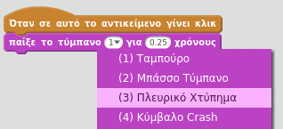
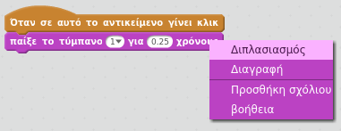

## Πρόκληση: βελτίωσε το τύμπανό σου

Μπορείς να αλλάξεις τον ήχο που κάνει το τύμπανο όταν πατηθεί;



Μπορείς επίσης να κάνεις το τύμπανο να βγάζει έναν ήχο όταν πατηθεί το πλήκτρο διαστήματος; Θα χρειαστεί να χρησιμοποιήσεις αυτό το μπλοκ `συμβάντος`{:class="blockevents"}:

```blocks3
when [διάστημα v] key pressed
```

Μπορείς να αντιγράψεις τον τρέχοντα κώδικα κάνοντας δεξί κλικ πάνω του και επιλέγοντας **διπλασιασμός**.

