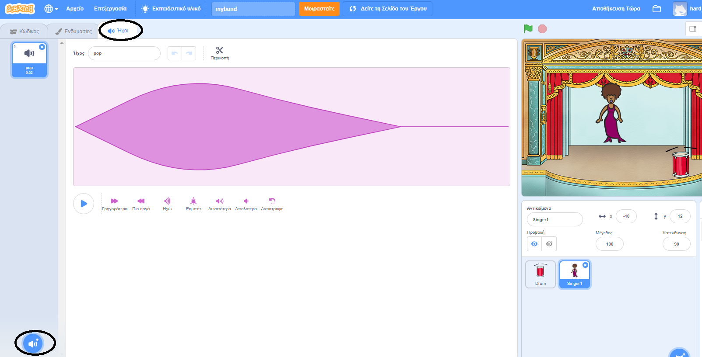
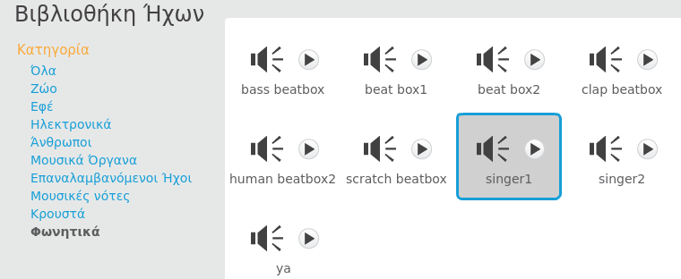

## Φτιάχνοντας μία τραγουδίστρια

Τώρα θα προσθέσεις μια τραγουδίστρια στη μπάντα σου!

--- task ---

Πρόσθεσε ένα χαρακτήρα τραγουδίστριας στο σκηνικό σου.


[[[generic-scratch3-sprite-from-library]]]

--- /task ---

--- task ---

Για να τραγουδήσει η τραγουδίστριά σου, πρέπει να προσθέσεις σε αυτή έναν ήχο. Βεβαιώσου ότι έχεις επιλέξει την τραγουδίστριά σου και στη συνέχεια κάνε κλικ στην καρτέλα Ήχοι και ξανά κλικ στο **Διαλέξτε έναν ήχο από τη βιβλιοθήκη**:

 --- /task ---

--- task --- Κάνε κλικ στο **Voice** στη λίστα που βρίσκεται στην κορυφή και, στη συνέχεια, επίλεξε έναν ήχο που θα προσθέσεις στο χαρακτήρα σου.

 --- /task ---

--- task --- Για να χρησιμοποιήσεις τον ήχο, πρόσθεσε τα ακόλουθα μπλοκ κώδικα στον χαρακτήρα τραγουδίστριας σου:

```blocks3
when this sprite clicked
play sound (singer1 v) until done
```

--- /task ---

--- task --- Κάνε κλικ στην τραγουδίστρια σου στο σκηνικό και δες τι συμβαίνει. Τραγουδάει; --- /task ---