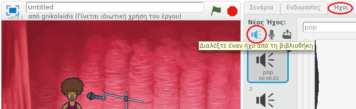

## Κάνοντας μία τραγουδίστρια

Ας προσθέσουμε μία τραγουδίστρια στη μπάντα σου!

+ Πρόσθεσε ακόμα δύο αντικείμενα στο σκηνικό σου: μία τραγουδίστρια και ένα μικρόφωνο.
    
    

+ Για να τραγουδήσει η τραγουδίστριά σου, πρέπει να προσθέσεις σε αυτή έναν ήχο. Βεβαιώσου ότι έχεις επιλέξει την τραγουδίστριά σου και στη συνέχεια κάνε κλικ στην καρτέλα Ήχοι και ξανά κλικ στο **Διαλέξτε έναν ήχο από τη βιβλιοθήκη**:
    
    

+ Εάν κάνεις κλικ στο **Φωνητικά** στην αριστερή πλευρά, τότε θα μπορείς να επιλέξεις έναν κατάλληλο ήχο για την τραγουδίστριά σου.
    
    

+ Τώρα που έχει προστεθεί ο ήχος, μπορείς να προσθέσεις αυτόν τον κώδικα στην τραγουδίστριά σου:
    
    ```blocks
        όταν σε αυτό το αντικείμενο γίνει κλικ
        παίξε τον ήχο [singer1] μέχρι το τέλος
    ```

+ Κάνε κλικ στην τραγουδίστριά σου και δες τι συμβαίνει. Τραγουδάει;