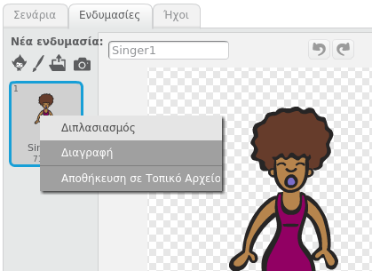
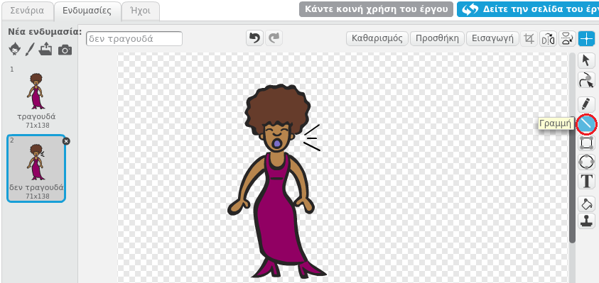
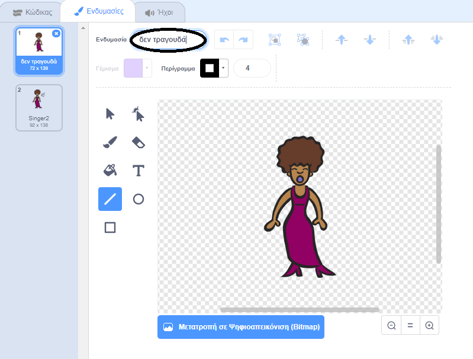

## Ενδυμασίες

Ας φτιάξουμε την τραγουδίστριά σου ώστε να φαίνεται σαν να τραγουδάει!

--- task --- Μπορείς επίσης να αλλάζεις τον τρόπο εμφάνισης του αντικειμένου τραγουδίστρια όταν γίνει κλικ, δημιουργώντας μια νέα ενδυμασία. Κάνε κλικ στην καρτέλα Ενδυμασίες και θα δεις την εικόνα της τραγουδίστριας.

 --- /task ---

--- task --- Κάνε δεξί κλικ στην ενδυμασία και ξανά κλικ στο **διπλασιασμός** για να δημιουργήσεις ένα αντίγραφο της ενδυμασίας.

 --- /task ---

--- task --- Κάνε κλικ στη νέα ενδυμασία (που ονομάζεται 'Singer2') και στη συνέχεια, επίλεξε το εργαλείο γραμμής και σχεδίασε γραμμές για να φανεί ότι η τραγουδίστρια βγάζει ήχο.

 --- /task ---

--- task --- Τα ονόματα των κοστουμιών δεν είναι πολύ χρήσιμα αυτή τη στιγμή. Πληκτρολόγησε στα πλαίσια κειμένου των κοστουμιών για να αλλάξεις τα ονόματά τους σε «δεν τραγουδάει» και «τραγουδάει».

 --- /task ---

--- task --- Τώρα που έχεις δύο διαφορετικές ενδυμασίες για την τραγουδίστριά σου, μπορείς να επιλέξεις ποια ενδυμασία εμφανίζεται! Πρόσθεσε αυτά τα δύο μπλοκ κώδικα στην τραγουδίστριά σου:

```blocks3
when this sprite clicked
+switch costume to (τραγουδάει v)
play sound (singer1 v) until done
+switch costume to (δεν τραγουδάει v)
```

Το μπλοκ κώδικα για την αλλαγή της ενδυμασίας βρίσκεται στην ενότητα `Όψεις`{:class="block3looks"}. --- /task ---

--- task --- Κάνε κλικ στην τραγουδίστρια σου στο σκηνικό και δες τι συμβαίνει. Τραγουδάει; --- /task ---

--- task --- Τώρα κάνε το τύμπανο σου να μοιάζει σαν να το χτυπάς!


- Χρησιμοποίησε τις οδηγίες για να αλλάξεις το κοστούμι της τραγουδίστριας σου για να σε βοηθήσει.

Θυμήσου να δοκιμάσεις ότι ο νέος κώδικας λειτουργεί --- /task ---