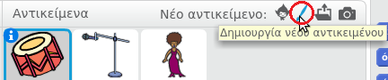
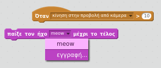

## Πρόκληση: βελτίωσε τη μπάντα σου

Χρησιμοποίησε αυτά που έχεις μάθει σε αυτό το έργο για να φτιάξεις τη δική σου μπάντα! Μπορείς να δημιουργήσεις όποια όργανα σου αρέσουν - δες τους διαθέσιμους ήχους και τα διαθέσιμα όργανα για να πάρεις μερικές ιδέες.


```blocks3
when this sprite clicked
set instrument to (\(1\) Piano v)
play note (60) for (0.25) beats
```

Ωστόσο, τα όργανά σου δεν χρειάζεται να έχουν λογική. Για παράδειγμα, θα μπορούσες να φτιάξεις ένα πιάνο από κεκάκια!


Μπορείς να χρησιμοποιήσεις περισσότερους χαρακτήρες από τη βιβλιοθήκη και μπορείς επίσης να ζωγραφίσεις τους δικούς σου χαρακτήρες!



--- collapse ---
---
title: Γιατί αναπηδά το αντικείμενό μου όταν αλλάζει ενδυμασία;
---

Όταν δημιουργείς το δικό σου αντικείμενο, μπορεί να διαπιστώσεις ότι όταν κάνεις κλικ πάνω του, αυτό 'αναπηδά' καθώς αλλάζει ενδυμασία. Αυτό συμβαίνει επειδή οι δύο ενδυμασίες δεν είναι στοιχισμένες στο ίδιο μέρος.

Για να το διορθώσεις, βεβαιώσου ότι τα κέντρα των κοστουμιών του χαρακτήρα σου βρίσκονται στο ίδιο σημείο.

--- /collapse ---

Αν έχεις ένα μικρόφωνο, μπορείς να εγγράψεις τους δικούς σου ήχους, ή ακόμα και να χρησιμοποιήσεις μια web κάμερα για να χτυπάς τα όργανά σου!

