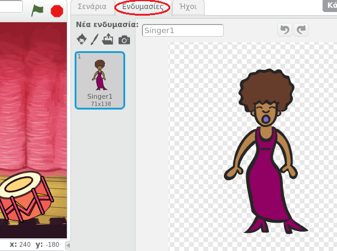
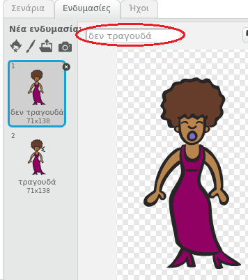
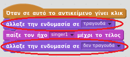

## Ενδυμασίες

Ας φτιάξουμε την τραγουδίστριά σου ώστε να φαίνεται σαν να τραγουδάει!

+ Μπορείς επίσης να αλλάζεις τον τρόπο εμφάνισης του αντικειμένου τραγουδίστρια όταν γίνει κλικ, δημιουργώντας μια νέα ενδυμασία. Κάνε κλικ στην καρτέλα Ενδυμασίες και θα δεις την εικόνα της τραγουδίστριας.
    
    

+ Κάνε δεξί κλικ στην ενδυμασία και ξανά κλικ στο **διπλασιασμός** για να δημιουργήσεις ένα αντίγραφο της ενδυμασίας.
    
    

+ Κάνε κλικ στη νέα ενδυμασία (που ονομάζεται 'Singer2') και στη συνέχεια, επέλεξε το εργαλείο γραμμής και σχεδίασε γραμμές για να φανεί ότι η τραγουδίστρια βγάζει ήχο.
    
    

+ Τα ονόματα των ενδυμασιών δεν βοηθούν πολύ αυτή τη στιγμή. Μετονόμασε τις δύο ενδυμασίες σε «δεν τραγουδά» και «τραγουδά» πληκτρολογώντας το νέο όνομα κάθε ενδυμασίας στο πλαίσιο κειμένου.
    
    

+ Τώρα που έχεις δύο διαφορετικές ενδυμασίες για την τραγουδίστριά σου, μπορείς να επιλέξεις ποια ενδυμασία εμφανίζεται! Πρόσθεσε αυτά τα δύο μπλοκ κώδικα στην τραγουδίστριά σου:
    
    
    
    Το μπλοκ κώδικα για την αλλαγή της ενδυμασίας βρίσκεται στην ενότητα `Όψεις`{:class="blocklooks"}.

+ Κάνε κλικ στην τραγουδίστριά σου. Μοιάζει σαν να τραγουδάει;