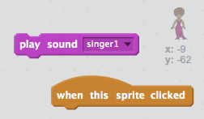
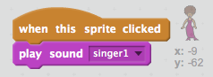

# Rock Band

## Introduction

In this project you'll learn how to code your own musical instruments!

<div class="scratch-preview">
  <iframe allowtransparency="true" width="485" height="402" src="https://scratch.mit.edu/projects/embed/26741186/?autostart=false" frameborder="0"></iframe>
  
</div>

## Step 1: Sprites

### Activity Checklist

[[[new-scratch-project]]]

+ Add the drum sprite from the Scratch library. (This doesn't need to be here if the next step has some context.)

[[[add-sprite-from-library]]]

+ Click the 'shrink' icon, and then click on the drum a few times to make it smaller.

	

## Save your project

[[[saving-scratch]]]

## Step 2: The Stage

### Activity Checklist

+ At the moment, the stage is white, and looks pretty boring! Let's add a backdrop to the stage.

[[[backdrop-from-library]]]

+ Your stage should look like this:

	

## Save your project

[[[saving-scratch]]]

## Step 3: Making a Drum

Let's code your drum to make a sound when it's hit.

### Activity Checklist

+ Add code to your drum sprite, so that it makes a drum sound when hit.

### Hint 1
{: .hint-heading #hint-1 }
When your drum sprite is __clicked__, it should __play a drum__ sound.
{: .hint-content .hint-1 }

### Hint 2
{: .hint-heading #hint-2 }
You'll need to use a __play sound__ block and a __when this sprite clicked__ block.
{: .hint-content .hint-2 }

### Hint 3
{: .hint-heading #hint-3 }
Here's the code you'll need:

{: .hint-content .hint-3 }

+ Click the drum to try out your new instrument!

## Save your project

[[[saving-scratch]]]

## Challenge: Improving your drum

+ Can you change the sound that the drum makes when it's clicked?


+ Can you also get the drum to make a sound when the spacebar is pressed? You'll need to use this `event` block:

```blocks
	when [space v] key pressed
```

You can copy your existing code by right-clicking on it and clicking 'duplicate'.


## Save your project

[[[saving-scratch]]]

# Step 4: Making a Singer

Let's add a singer to your band!

## Activity Checklist

+ Add another 2 sprites to your stage; a singer and a microphone.

	

+ Add the 'singer1' sound to your singer sprite.

[[[sound-from-library]]]

+ Once the sound has been added, add code to make the singer sing when clicked.

### Hint 1
{: .hint-heading #hint-1 }
When your singer sprite is __clicked__, it should __play__ the 'singer1' __sound__.
{: .hint-content .hint-1 }

### Hint 2
{: .hint-heading #hint-2 }
You'll need to use these blocks:

{: .hint-content .hint-2 }

### Hint 3
{: .hint-heading #hint-3 }
Here's the code you'll need:

{: .hint-content .hint-3 }

## Save your project

[[[saving-scratch]]]

# Step 5: Costumes

Let's make your singer look like she's singing!

## Activity Checklist

+ Create a second costume for your singer, and make it look as though she is singing. You should name your costumes 'not singing' and 'singing'.

	
	

[[[duplicate-costumes]]]

+ Now that you have 2 different costumes for your singer, can you change how your singer looks when she's singing?

### Hint 1
{: .hint-heading #hint-1 }
When your singer sprite is clicked, you should change the singer's costume. Once the sound has played, you can change the costume back.
{: .hint-content .hint-1 }

### Hint 2
{: .hint-heading #hint-2 }
You'll need to use these blocks:

{: .hint-content .hint-2 }

### Hint 3
{: .hint-heading #hint-3 }
Here's the code you'll need:

{: .hint-content .hint-3 }

+ Test your singer. When clicked, your singer should now look like she is singing!

##Challenge: Changing your drum's costume
Can you make your drum look like it's being hit? If you need help, you can use the instructions for changing your singer's costume above.


Remember to test that your new code works!

## Save your project

[[[saving-scratch]]]

##Challenge: Make your own band

Use what you've learnt in this project to make your own band! You can create any instruments you like, but look at the available sounds and instruments to get some ideas.


Your instruments don't have to be sensible though. For example, you could make a piano made out of muffins!


As well as using existing sprites, you can also draw your own.


If you have a microphone you can record your own sounds, or even use a webcam to hit your instruments!


## Save your project

[[[saving-scratch]]]
