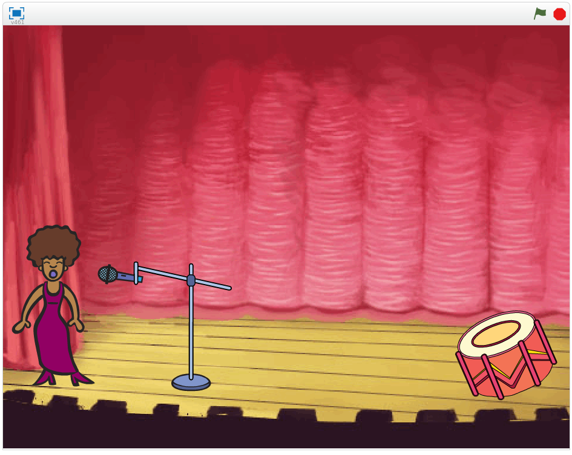

## What you will make

Learn how to code your own musical instruments!

--- print-only ---

--- /print-only ---

--- no-print ---

Click the green flag to begin. Then, click on the singer or the drum to hear what they sound like.

  <iframe allowtransparency="true" width="485" height="402" src="https://scratch.mit.edu/projects/embed/276872220/?autostart=false" frameborder="0" scrolling="no"></iframe>

--- /no-print ---

