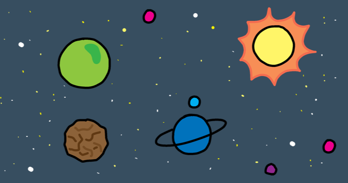
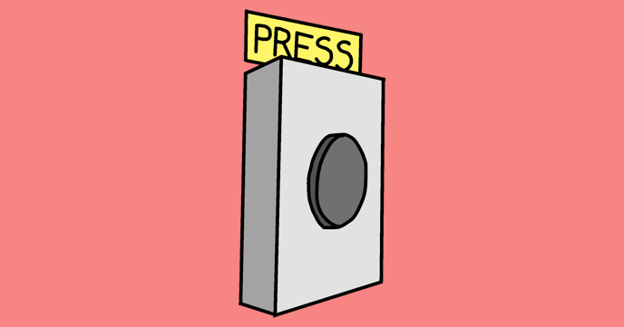

## What next?

Now that you've built your first Scratch project, why not take a look at the [Lost in space](https://projects.raspberrypi.org/en/projects/lost-in-space/) Scratch project?

Or if you like the idea of doing more projects using sounds and music, you can try out the [Compose a tune](https://projects.raspberrypi.org/en/projects/compose-tune) Sonic Pi project!

