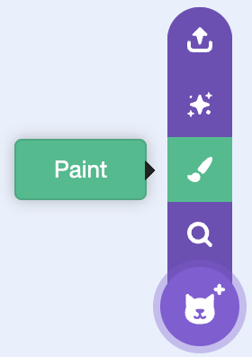

--- challenge ---
## Challenge: Make your own band

Use what you've learnt in this project to make your own band! You can create any instruments you like, but look at the available sounds and instruments to get some ideas.

Your instruments don't have to be sensible though. For example, you could make a piano made out of muffins!

As well as using existing sprites, you can also draw your own.

If you have a microphone you can record your own sounds, or even use a webcam to hit your instruments!

--- /challenge ---
