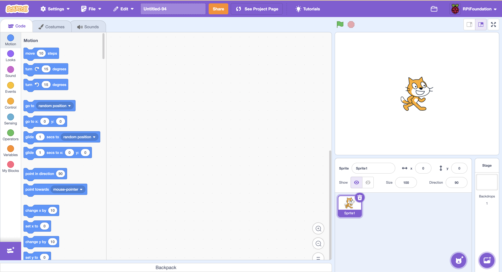
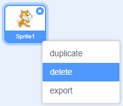

## Step 1: Sprites

### Activity Checklist

+ First, open up the Scratch editor. You can find the online Scratch editor at <a href="http://jumpto.cc/scratch-new" target="_blank">jumpto.cc/scratch-new</a>. It looks like this:

	

+ The cat sprite that you can see is the Scratch mascot. Let's get rid of it, by right-clicking and then clicking 'delete'.

	

+ Next, click 'Choose sprite from library' to open up a list of all the Scratch sprites.

	

+ Scroll down until you see a drum sprite. Click on a drum, and click 'OK' to add it to your project.

	

+ Click the 'shrink' icon, and then click on the drum a few times to make it smaller.

	

### Save your project

Give your program a name, by typing one into the text box in the top-left corner.

You can then click 'File' and then 'Save now' to save your project.

(If you don't have a Scratch account, you can save a copy of your project by clicking 'Download to your computer' instead).
