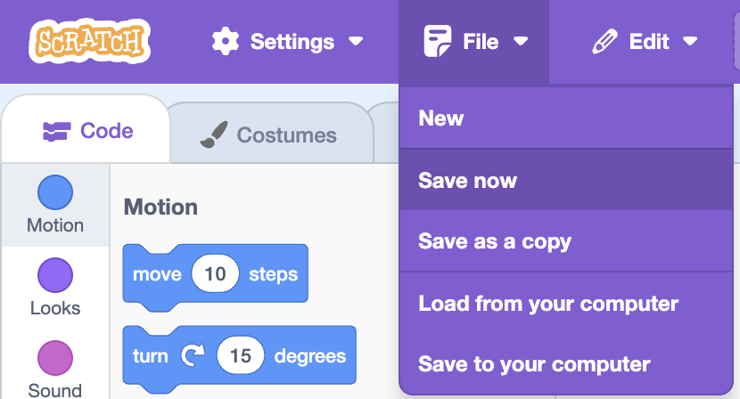

## Sprites

--- task ---

Open a [new Scratch project](http://rpf.io/scratch-new){:target="_blank"}.

It looks like this:

![A screenshot of the Scratch programming interface. The interface has a purple top bar with options such as "File," "Edit," and "Share." On the left, there is a code blocks panel, with blocks for "Motion," "Looks," "Sound," "Events," and other categories. The "Motion" section is expanded, showing blue blocks with commands like "move 10 steps," "turn 15 degrees," and "go to random position." In the center is a blank coding workspace. On the right, the Scratch Cat sprite is visible in a preview area, with controls for sprite properties like "x," "y," "size," and "direction" below.](images/band-scratch.png)

--- /task ---

--- task ---

If you are signed in to your Scratch account, type the title of your project into the project title box at the top of the screen:

**Tip:** Give your projects helpful names so that you can easily find them when you have lots of projects.

--- /task ---

--- task ---

If you are not online or don't have a Scratch account, you can save a copy of your project by clicking on **Save to your computer** instead.

--- /task ---

--- task ---

The cat sprite that you can see is the Scratch mascot. You don't need it for this game, so get rid of it by clicking on the X in the corner.

--- /task ---

--- task ---

Next, click on **Choose sprite from library** to open up a list of all the Scratch sprites.

--- /task ---

--- task ---

Scroll down until you see a drum sprite. Click on a drum to add it to your project.

--- /task ---

