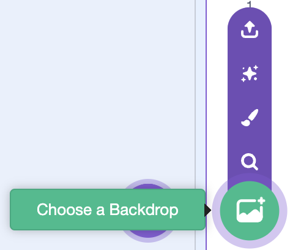
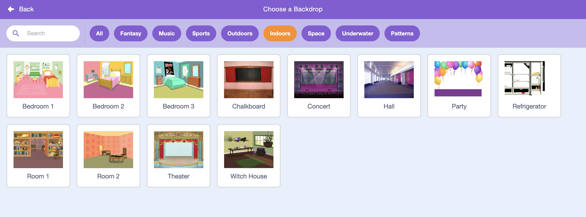

## The stage

The __Stage__ is the area on the left, and is where your project comes to life. Think of it as a performance area, just like a real stage!

+ At the moment, the stage is white, and looks pretty boring! Let's add a backdrop to the stage, by clicking **Choose backdrop from library**.

	

+ Click **Indoors** on the left, and then click on a stage backdrop and click **OK**.

	

+ Your stage should now look like this:

	
