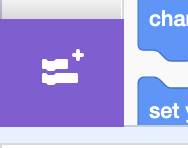
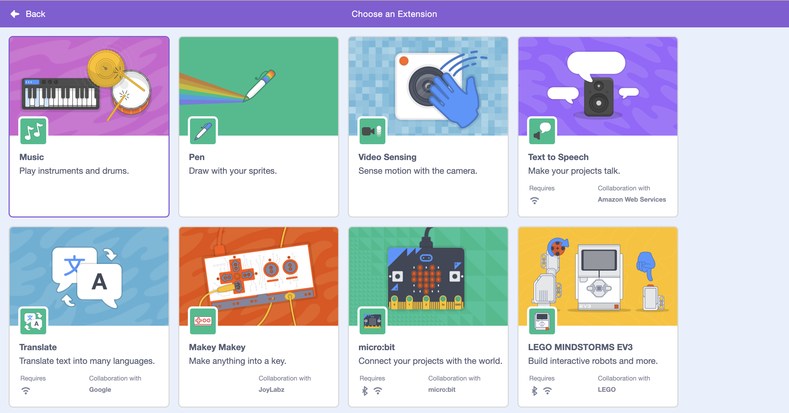
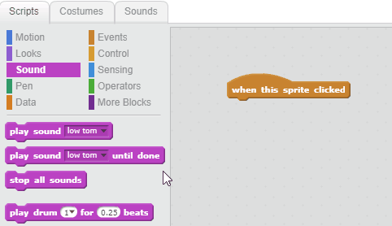

## Make a drum

Now you will add code to your drum so that the drum makes a sound when it's clicked.

First add the **Music** extension so you can play instruments:

--- task ---

Click on the **Add extension** button in the bottom left-hand corner.



--- /task ---

--- task ---

Click on the **Music** extension to add it.



--- /task ---

--- task ---

Click on the drum sprite, and then drag these two blocks into the code area on the right:

```blocks3
when this sprite clicked
play drum (\(1\) Snare Drum v) for (0.25) beats
```

--- no-print ---



--- /no-print ---

Make sure that the blocks are connected together (like LEGO bricks).

--- /task ---

--- task ---

Click on the drum to try out your new instrument!

--- /task ---
