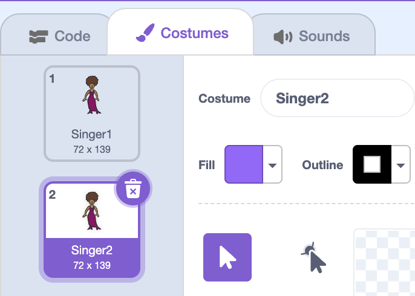

# Step 4: Costumes

Let's make your singer look like she's singing!

## Activity Checklist

+ Create a second costume for your singer, and make it look as though she is singing. You should name your costumes 'not singing' and 'singing'.

	
	

[[[duplicate-costumes]]]

+ Now that you have 2 different costumes for your singer, can you change how your singer looks when she's singing?

### Hint 1
{: .hint-heading #hint-1 }
When your singer sprite is clicked, you should change the singer's costume. Once the sound has played, you can change the costume back.
{: .hint-content .hint-1 }

### Hint 2
{: .hint-heading #hint-2 }
You'll need to add these blocks to your singer's code:

{: .hint-content .hint-2 }

### Hint 3
{: .hint-heading #hint-3 }
Here's the code you'll need:

{: .hint-content .hint-3 }

+ Test your singer. When clicked, your singer should now look like she is singing!

##Challenge: Changing your drum's costume
Can you make your drum look like it's being hit? If you need help, you can use the instructions for changing your singer's costume above.

Remember to test that your new code works!

## Save your project

[[[saving-scratch]]]

##Challenge: Make your own band

Use what you've learnt in this project to make your own band! You can create any instruments you like, but look at the available sounds and instruments to get some ideas.

Your instruments don't have to be sensible though. For example, you could make a piano made out of muffins!

As well as using existing sprites, you can also draw your own.

If you have a microphone you can record your own sounds, or even use a webcam to hit your instruments!

## Save your project

[[[saving-scratch]]]
