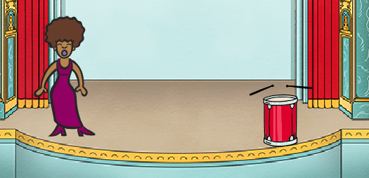
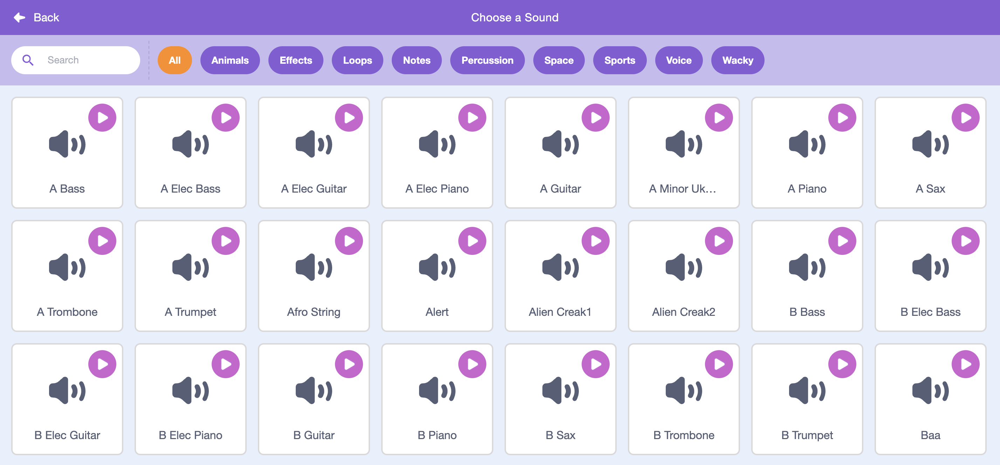

## Making a singer

Let's add a singer to your band!

--- task ---

Add another two sprites to your stage: a singer and a microphone.


--- /task ---

--- task ---
Before you can make your singer sing, you need to add a sound to your sprite. Make sure that you have selected your singer, then click the Sounds tab, and click **Choose sound from library**:


--- /task ---

--- task ---
If you click **Vocals** on the left-hand side, you will then be able to choose a suitable sound to add to your sprite.


--- /task ---

--- task ---
Now that the sound has been added, you can add this code to your singer:

```blocks
when this sprite clicked
play sound [singer1 v] until done
```
--- /task ---

--- task ---
Click on your singer and see what happens. Does she sing?
--- /task ---
