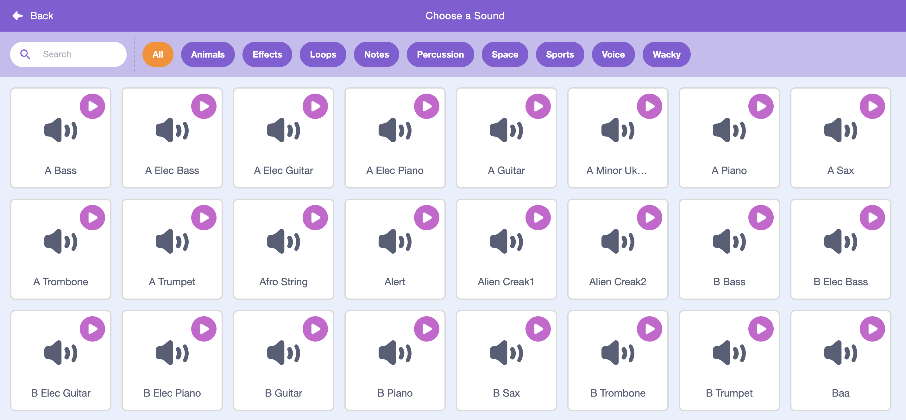
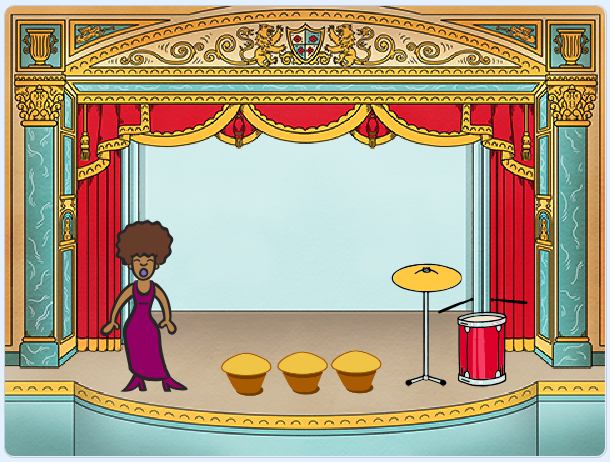
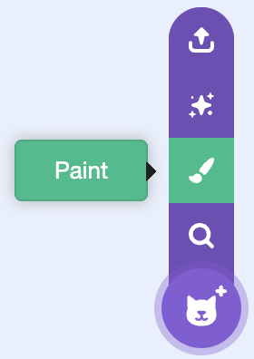

## Challenge: improve your band

---- task ---
Add more instruments to make your own band! You can create any instruments you like — look at the available instrument sprites and sounds to get some ideas.



```blocks3
when this sprite clicked
set instrument to (\(1\) Piano v)
play note (60) for (0.25) beats
```

Your instruments don't have to be realistic though. For example, you could make a piano made out of muffins!


--- /task ---

---- task ---
If you have a microphone, record your own sounds, and you can even use a webcam to hit your instruments!


--- /task ---

---- task ---
Can you change the sound that the drum makes when it's clicked?


--- /task ---

---- task ---
Can you also get the drum to make a sound when the space bar is pressed? You'll need to use this `event`{:class="block3events"} block:

```blocks3
when [space v] key pressed
```
--- /task ---

---- task ---
Paint your own sprites!



--- /task ---

--- collapse ---
---
title: Why is my sprite 'jumping' when it changes costume?
---

When creating your own sprite, you may find that when you click the sprite, it 'jumps' as it changes costume. This is because the two costumes aren't centered in the same place.

To fix this, make sure that the centres of your sprite's costumes are the same.

--- /collapse ---