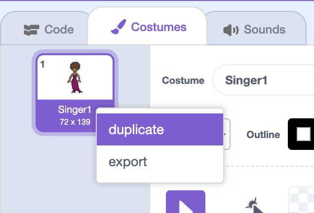
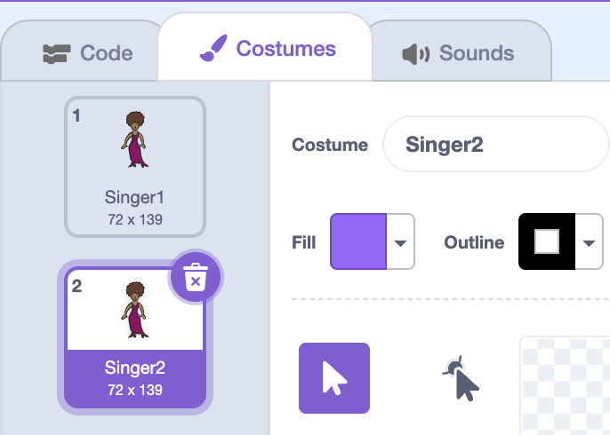

## Costumes

Let's make your singer look like she's singing!

--- task ---
You can also change how your singer sprite looks when it's clicked by creating a new costume. Click the Costumes tab, and you'll see the singer image.


--- /task ---

--- task ---
Right-click on the costume and click **duplicate** to create a copy of the costume.


--- /task ---

--- task ---
Click on the new costume (called 'Singer2'), and then select the line tool and draw lines to make it look like your singer is making a sound.


--- /task ---

--- task ---
The names of the costumes aren't very helpful at the moment. Rename the two costumes so they are called 'not singing' and 'singing' by typing the new name of each costume into the text box.


--- /task ---

--- task ---
Now that you have two different costumes for your singer, you can choose which costume is displayed! Add these two blocks to your singer:

```blocks
when this sprite clicked
+switch costume to [singing v]
play sound [singer1 v] until done
+switch ostume to [not singing]
```

The code block for changing the costume is in the `Looks`{:class="blocklooks"} section.
--- /task ---

--- task ---
Click on your singer. Does she look like she is singing?
--- /task ---

--- task ---
Now make your drum look like it's being hit?


- Use the same instructions for changing your singer's costume in the previous step to help you.

Remember to test that your new code works!
--- /task ---
