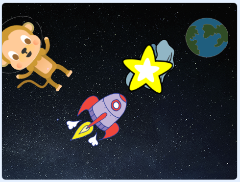

## What can you do now?

If you are following the [Scratch: Module 1](https://projects.raspberrypi.org/en/pathways/scratch-module-1) pathway, you can move on to the [Lost in space](https://projects.raspberrypi.org/en/projects/lost-in-space?utm_source=pathway&utm_medium=whatnext&utm_campaign=projects) project. In this project, you will do create a space-themed animation.

--- print-only ---

--- /print-only ---

--- no-print ---

Click on the green flag to see the animation.

  <iframe allowtransparency="true" width="485" height="402" src="https://scratch.mit.edu/projects/embed/276873231/?autostart=false" frameborder="0" scrolling="no"></iframe>
  

--- /no-print ---

Or, why not try out another [Scratch](https://projects.raspberrypi.org/en/projects?software%5B%5D=scratch) project.

