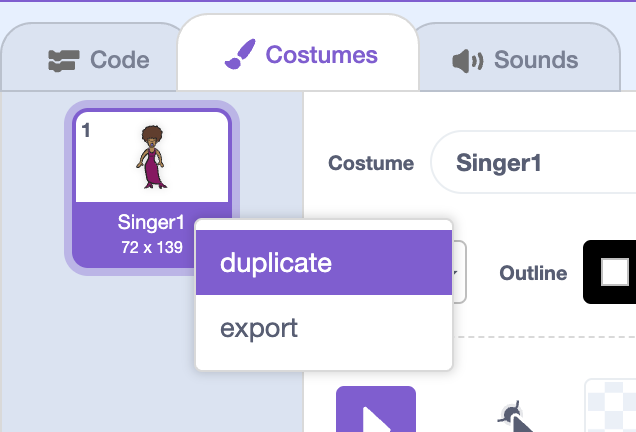

## Costumes

Let's make your singer look like she's singing!

+ You can also change how your singer sprite looks when it's clicked, by creating a new costume. Click the 'Costumes' tab, and you'll see the singer image.

	

+ Right-click on the costume and click 'duplicate' to create a copy of the costume.

	

+ Click on the new costume (called 'Singer2') and then select the line tool and draw lines to make it look like your singer is making a sound.

	

+ The names of the costumes aren't very helpful at the moment. Rename the 2 costumes to 'not singing' and 'singing' by typing the new name of each costume into the text box.

	

+ Now that you have 2 different costumes for your singer, you can choose which costume is displayed! Add these 2 blocks to your singer:

	

	The code block for changing the costume is in the `Looks`{:class="blocklooks"} section.

+ Test your singer. When clicked, your singer should now look like she is singing!

