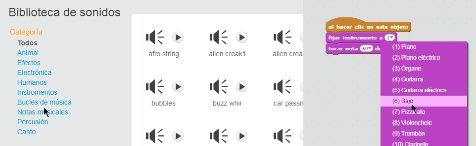
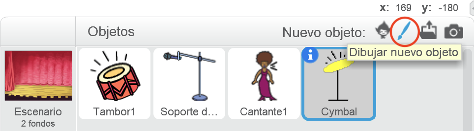
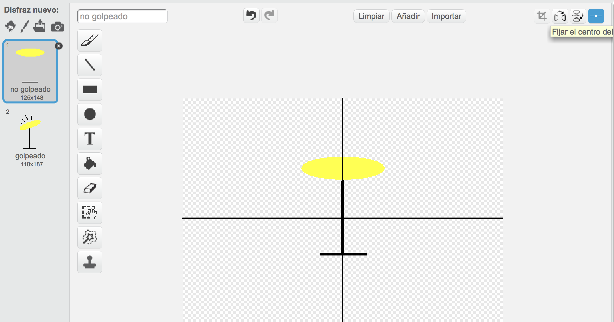
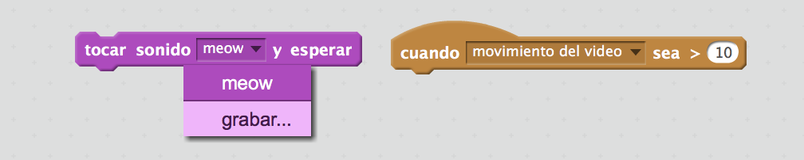

--- challenge ---

## Desafío: crea tu propia banda

¡Usa lo que has aprendido en este proyecto para crear tu propia banda! Puedes crear cualquier instrumento que quieras - para darte algunas ideas, echa un vistazo a los sonidos y instrumentos disponibles.

Tus instrumentos no tienen que ser lógicos. Por ejemplo, ¡podrías crear un piano hecho de muffins!

Además de utilizar objetos existentes, también puedes dibujar uno nuevo.

--- collapse ---
---
title: ¿Por qué 'salta' el objeto cuando cambia de disfraz?
---

+ Cuando creas tu propio objeto, a lo mejor descubrirás que cuando haces clic encima de él, este 'salta' cuando cambia de disfraz. Esto pasa si los dos disfraces no están centrados en el mismo punto.

Para arreglarlo, haz clic en **Fijar el centro del disfraz** para los dos disfraces, y asegúrate de que el centro esté en el mismo punto en ambos.

--- /collapse ---

Si tienes un micrófono, puedes grabar tus propios sonidos, ¡o incluso usar una cámara web para tocar tus instrumentos!

--- /challenge ---