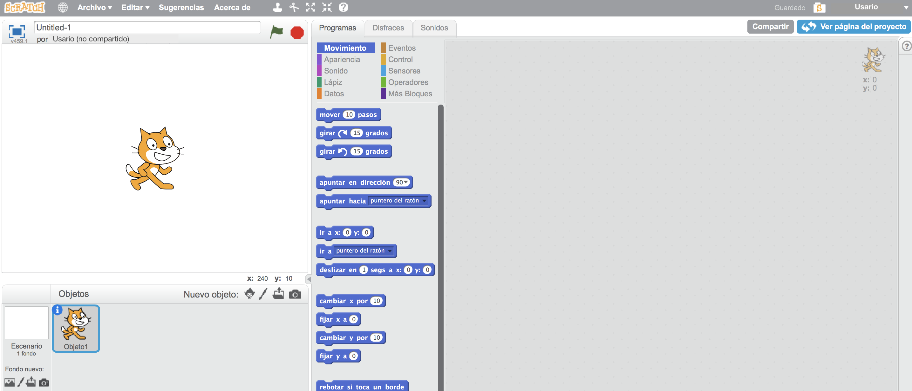
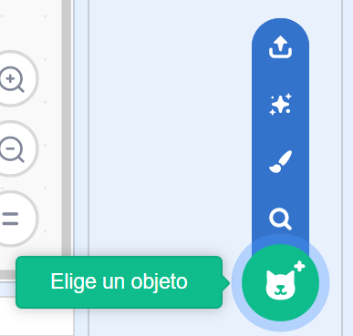
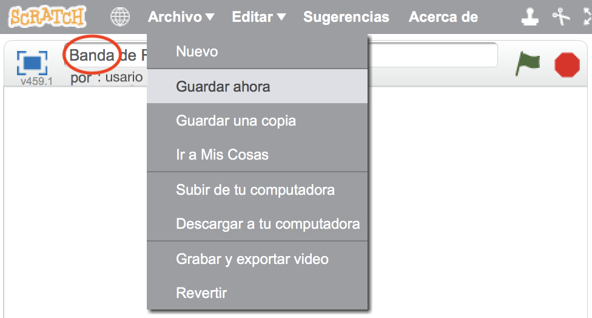

## Objetos

Antes de comenzar la codificación, necesitas añadir una “cosa” que animar. En Scratch, estas “cosas” se llaman **objetos**.

\--- task \---

Abre un nuevo proyecto de Scratch.

**En línea:** abre un nuevo proyecto en línea de Scratch en [rpf.io/scratch-new](http://rpf.io/scratch-new){:target="_blank"}.

**Sin conexión:** abre un nuevo proyecto en el editor sin conexión.

Si necesitas descargar e instalar el editor sin conexión de Scratch, puedes encontrarlo en [rpf.io/scratchoff](http://rpf.io/scratchoff){:target="_blank"}.

Se ve así:

\--- /task \---

\--- task \---

The cat sprite that you can see is the Scratch mascot. You don't need it for this game, so get rid of it by clicking on the X in the corner.

\--- /task \---

\--- task \---

Luego, haz clic en **Elige un objeto de la biblioteca** para abrir una lista de todos los objetos de Scratch.

\--- /task \---

\--- task \---

Baja hasta encontrar el objeto tambor. Haz clic en un tambor para añadirlo a tu proyecto.

\--- /task \---

\--- task \---

Haz clic y arrastra el tambor hasta la parte inferior del escenario.

\--- /task \---

\--- task \---

Dale un nombre a tu proyecto escribiéndolo en el cuadro de texto en la parte superior.

Luego haz clic en **Archivo**, y luego en **Guardar ahora** para guardar tu proyecto.

Si no estás conectado o no tienes una cuenta de Scratch, puedes guardar una copia de tu proyecto haciendo clic en **Guardar en tu ordenador**.

\--- /task \---