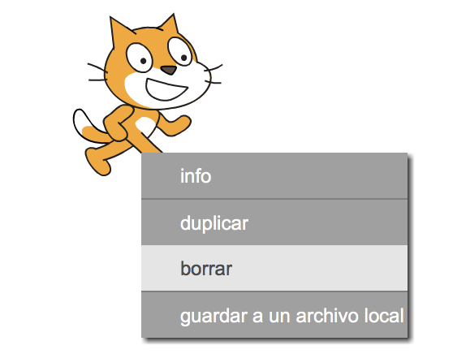
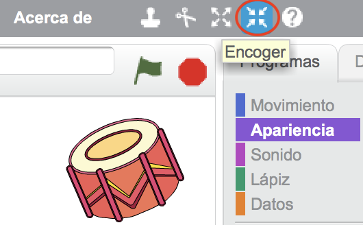

## Objetos

Antes de comenzar la codificación, necesitas añadir una “cosa” que animar. En Scratch, estas “cosas” se llaman **objetos**.

+ Para empezar, abre el editor de Scratch. Puedes encontrar el editor en línea de Scratch en <a href="http://jumpto.cc/scratch-new" target="_blank">jumpto.cc/scratch-new</a>. Éste es su aspecto:
    
    

+ El objeto gato que ves es la mascota de Scratch. Borrémoslo haciendo clic en la figura con el botón derecho y luego haciendo clic en **borrar**.
    
    

+ Luego, haz clic en **Selecciona un objeto de la biblioteca** para abrir una lista con todos los objetos de Scratch.
    
    

+ Baja hasta encontrar el objeto de un tambor. Selecciona un tambor, y haz clic en **“OK”** para añadirlo a tu proyecto.
    
    

+ Haz clic en el icono **encoger**, y luego haz clic en el tambor unas cuantas veces para hacerlo más pequeño.
    
    

Dale un nombre a tu proyecto escribiéndolo en la casilla de texto de la parte superior del escenario.

Después puedes hacer clic en **Archivo** y **Guardar ahora** para guardar tu proyecto. Si no tienes una cuenta de Scratch, puedes guardar una copia de tu proyecto haciendo clic en **Descargar a tu computadora**.

