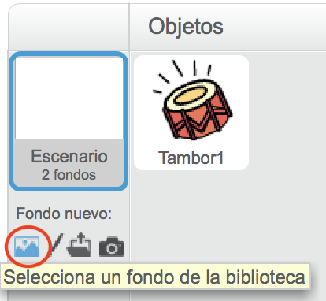
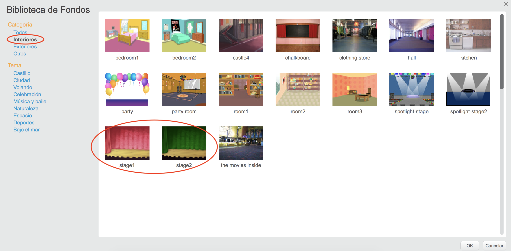

## El Escenario

The **Stage** is the area on the right, and is where your project comes to life. Think of it as a performance area, just like a real stage!

\--- task \---

At the moment, the stage is white and looks pretty boring! Add a backdrop to it by clicking on **Choose a backdrop**.

\--- /task \---

\--- task \---

Click on **Indoors** in the list at the top. Then click on a theatre backdrop.

\--- /task \---

\--- task \---

Your stage should now look similar to this:

\--- /task \---