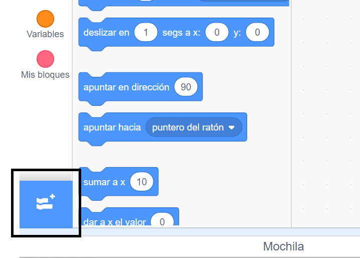
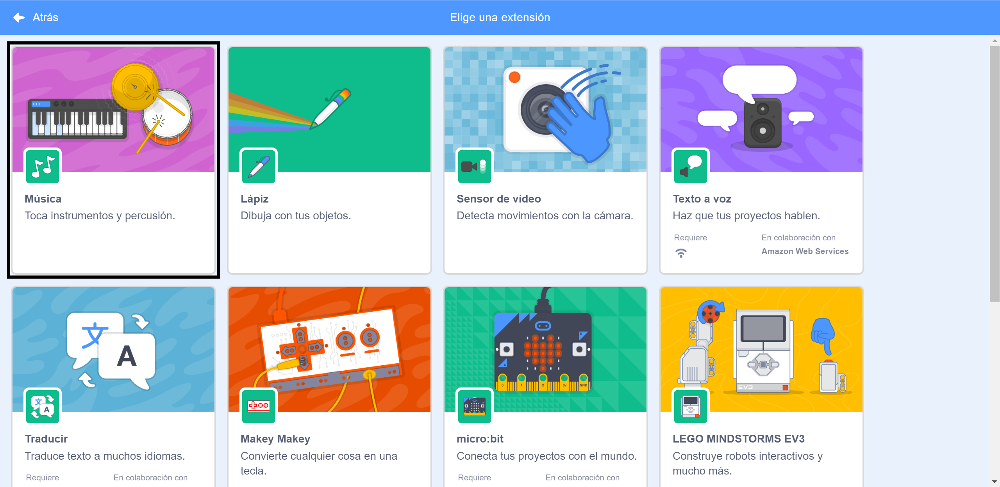
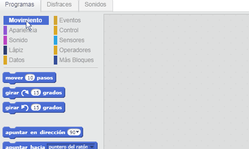

## Crear un tambor

Ahora vas a añadir código a tu tambor para que haga un sonido cuando se haga clic sobre él.

Puedes encontrar los bloques de código en la pestaña Programas, ¡y todos están codificados por colores!

--- task ---

Primero añade la extensión **Música** para que puedas tocar instrumentos.

Haz clic en el botón **Añadir extensión** en la esquina inferior izquierda.



Haz clic en la extensión **Música** para añadirla.



--- /task ---

--- task ---

Haz clic en el objeto tambor, y luego arrastra estos dos bloques al área de código de la derecha:

```blocks3
when this sprite clicked
play drum (\(1\) Caja v) for (0.25) beats
```

--- no-print ---



--- /no-print ---

Asegúrate de que los bloques estén conectado entre sí (como piezas de LEGO).

--- /task ---

--- task ---

¡Haz clic en el tambor para probar tu nuevo instrumento!

--- /task ---