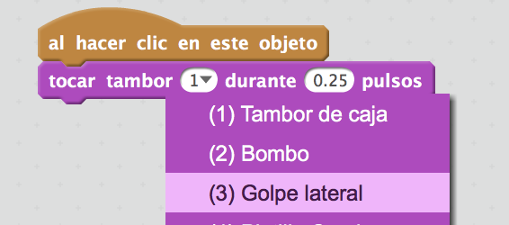
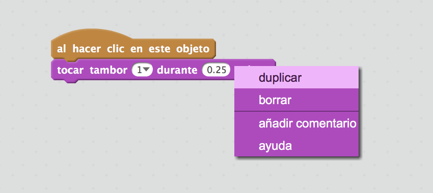

## Desafío: mejorar tu tambor

¿Sabes cómo cambiar el sonido del tambor cuando haces clic encima de él?



Can you also get the drum to make a sound when the space bar is pressed? You'll need to use this `event`{:class="block3events"} block:

```blocks3
al presionar tecla [espacio v]
```

If you want to copy your existing code, right-click on it and then click on **duplicate**.

