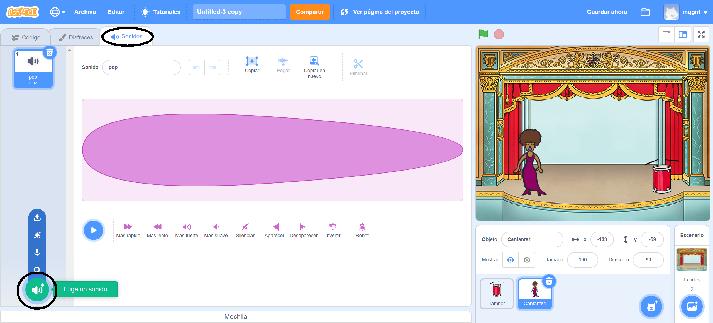
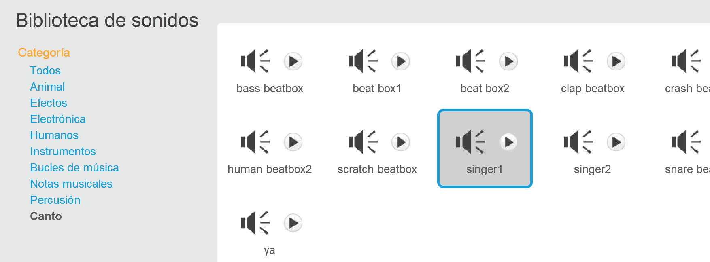

## Crear un cantante

¡Ahora vas a añadir un cantante a tu banda!

\--- task \---

Añade un objeto de cantante a tu escenario. (Nota: en los siguientes ejemplos cambia el nombre del objeto, sonido y disfraz de Singer1 a Cantante1).


[[[generic-scratch3-sprite-from-library]]]

\--- /task \---

\--- task \---

Antes de que puedas hacer cantar a tu cantante, tienes que añadir un sonido al objeto. Asegúrate de haber seleccionado tu objeto cantante, luego haz clic en la pestaña Sonidos y haz clic en **Elige un sonido**:



\--- /task \---

\--- task \---

Haz clic en **Voz** en la lista en la parte superior, y luego elige un sonido para añadir a tu objeto.



\--- /task \---

\--- task \---

Para usar el sonido, añade los siguientes bloques de código a tu objeto cantante:

```blocks3
al hacer clic en este objeto
tocar sonido (Cantante1 v) hasta que termine
```

\--- /task \---

\--- task \---

Haz clic en tu cantante para ver qué pasa. ¿Canta?

\--- /task \---