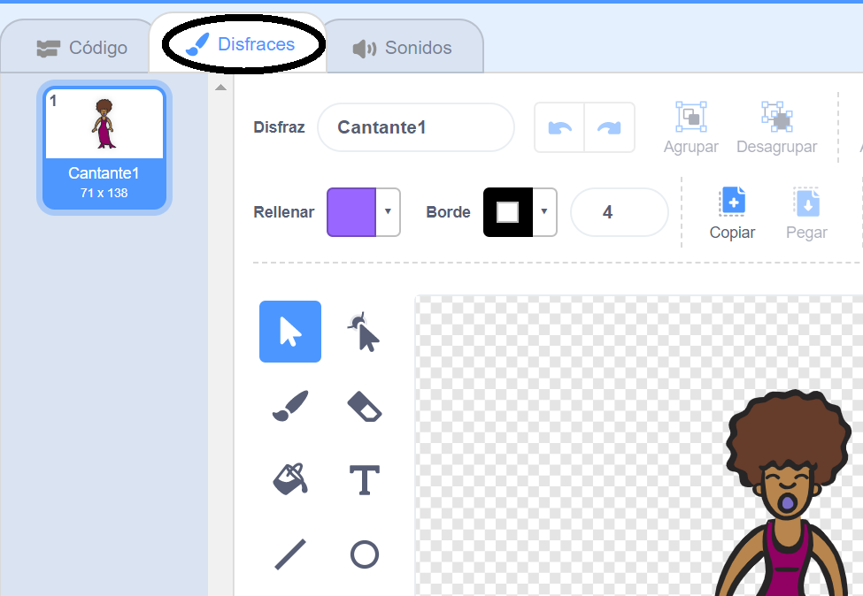
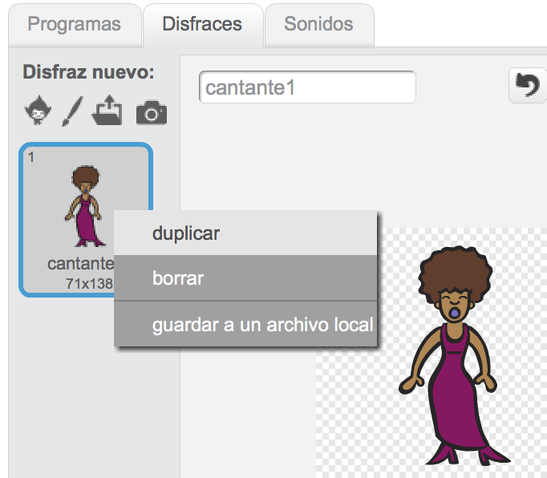
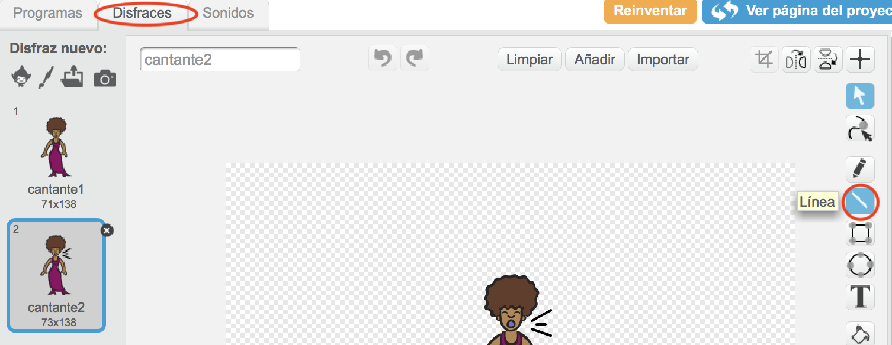
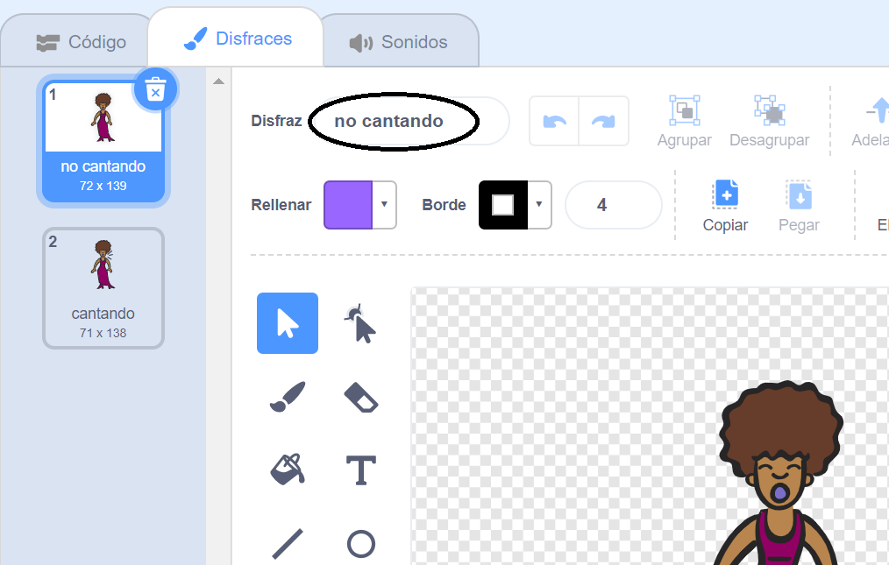

## Disfraces

¡Ahora harás que tu cantante parezca que está cantando!

\--- tarea \--- Puedes cambiar el aspecto de tu sprite cantante cuando se hace clic creando un nuevo disfraz. Haz clic en la pestaña Disfraces y verás el disfraz de cantante.

 \--- /task \---

\--- tarea \--- Haga clic derecho en el disfraz y luego haga clic en **duplicado** para crear una copia del mismo.

 \--- /task \---

\--- tarea \--- Haz clic en el nuevo traje (llamado 'Singer2'), y luego selecciona la herramienta de línea y dibuja líneas para que parezca que tu cantante está haciendo un sonido.

 \--- /task \---

\--- tarea \--- Los nombres de los disfraces no son muy útiles en este momento. Escriba en los cuadros de texto de los disfraces para cambiar sus nombres a "no cantar" y "cantar".

 \--- /task \---

\--- tarea \--- Ahora que tienes dos trajes diferentes para tu cantante, ¡puedes elegir qué traje se muestra! Agregue estos dos bloques de código a su sprite cantante:

```blocks3
cuando este sprite hizo clic en
+ cambia el disfraz a (canto v)
reproduce el sonido (cantante1 v) hasta que se hace
+ cambia el disfraz a (no canta v)
```

El bloque de código para cambiar el disfraz se encuentra en la sección `Looks`{: class = "block3looks"}. \--- / tarea \---

\--- tarea \--- Haz clic en tu cantante en el escenario. ¿Parece que está cantando? \--- / tarea \---

\--- tarea \--- Ahora haz que tu tambor parezca que está siendo golpeado!


- Usa las instrucciones para cambiar el disfraz de sprite de tu cantante para ayudarte.

¡Recuerde probar que su nuevo código funciona! \--- / tarea \---