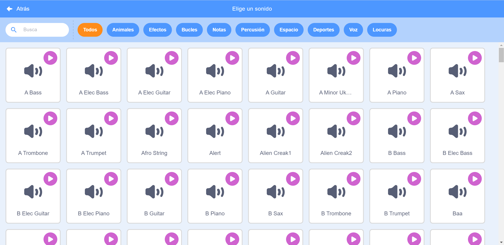

## Disfraces

¡Usa lo que has aprendido en este proyecto para hacer tu propia banda! Puedes crear cualquier instrumento que quieras: echa un vistazo a los objetos y sonidos de instrumentos disponibles para darte algunas ideas.



```blocks3
al hacer clic en este objeto
fijar instrumento a ((1) Piano v)
tocar nota (60) durante (0.25) tiempos
```

Tus instrumentos no tienen por qué ser realistas. Por ejemplo, ¡podrías hacer un piano hecho de magdalenas!


¡Puedes usar más objetos de la biblioteca, y también puedes pintar tus propios objetos!


--- collapse ---
---
title: ¿Por qué 'salta' el objeto cuando cambia de disfraz?
---

Cuando creas tu propio objeto, a lo mejor descubrirás que cuando haces clic encima de él, este 'salta' cuando cambia de disfraz. Esto pasa si los dos disfraces no están centrados en el mismo punto.

Para arreglarlo, asegúrate de que los centros de los disfraces de tu objeto sean los mismos.

--- /collapse ---

Si tienes un micrófono, puedes grabar tus propios sonidos e incluso puedes usar una webcam para darle a tus instrumentos!

