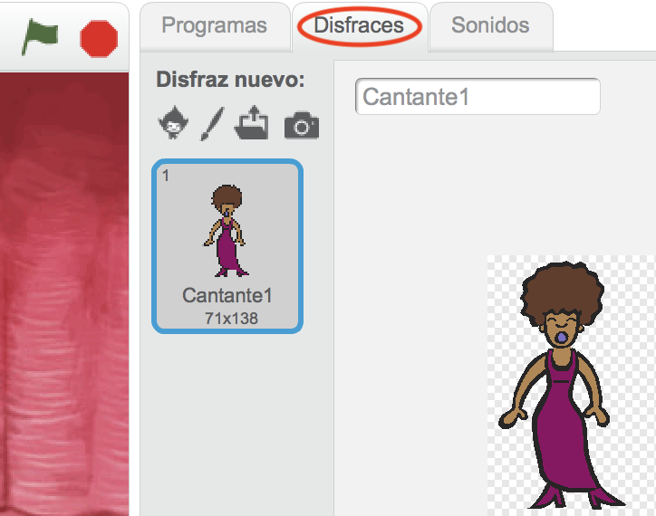
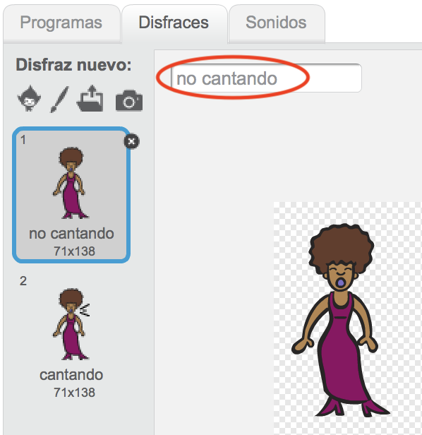
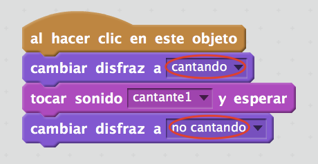

## Disfraces

¡Vamos a hacer que parezca que la cantante esté cantando!

+ Si creas un nuevo disfraz, también puedes cambiar el aspecto de tu cantante cuando haces clic para que cante. Haz clic en la pestaña Disfraces y verás la imagen de la cantante.
    
    

+ Haz clic derecho en el disfraz y luego clica en **duplicar** para crear una copia del disfraz.
    
    

+ Haz clic en el nuevo disfraz (llamado 'Cantante2'), luego selecciona la herramienta línea y dibuja líneas para que parezca que tu cantante esté cantando.
    
    

+ Ahora mismo los nombres de los disfraces no son muy útiles. Cambia el nombre de los dos disfraces para que se llamen 'no cantando' y 'cantando', escribiendo el nuevo nombre de cada uno en el cuadro de texto.
    
    

+ Ahora que tienes dos disfraces diferentes para tu cantante, ¡puedes escoger cual de ellos se visualiza! Agrega estos dos bloques a tu cantante:
    
    
    
    El bloque de código para cambiar de disfraz se encuentra en la pestaña `Apariencia`{:class="blocklooks"}.

+ Haz clic en tu cantante. ¿Parece que está cantando?
