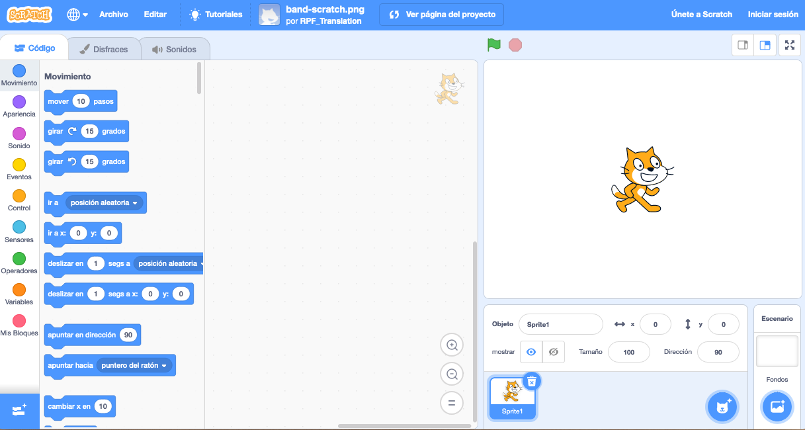
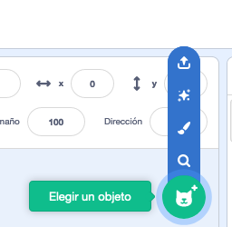
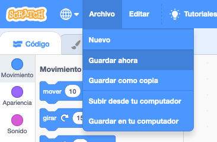

## Objetos

Antes de comenzar la codificación, necesitas añadir una “cosa” que animar. En Scratch, estas “cosas” se llaman **objetos**.

\--- task \---

Abrir un nuevo proyecto de Scratch vacío.

**En línea:** abre un nuevo proyecto en línea de Scratch en [rpf.io/scratch-new](http://rpf.io/scratch-new){:target="_blank"}.

**Sin conexión:** abre un nuevo proyecto en el editor sin conexión.

Si necesitas descargar e instalar el editor sin conexión de Scratch, puedes encontrarlo en [rpf.io/scratchoff](http://rpf.io/scratchoff){:target="_blank"}.

Se ve así:

\--- /task \---

\--- task \---

El objeto gato que ves es la mascota de Scratch. No lo necesitas para este juego, así que elimínalo haciendo clic en la X de la esquina.

\--- /task \---

\--- task \---

Luego, haz clic en **Elige un objeto de la biblioteca** para abrir una lista de todos los objetos de Scratch.

\--- /task \---

\--- task \---

Baja hasta encontrar el objeto tambor. Haz clic en un tambor para añadirlo a tu proyecto.

\--- /task \---

\--- task \---

If you are signed in to your Scratch account, type the title of your project into the project title box at the top of the screen:

**Tip:** Give your projects helpful names so that you can easily find them when you have lots of projects.

Next, click on File, and then on Save now to save your project.

Si no estás conectado o no tienes una cuenta de Scratch, puedes guardar una copia de tu proyecto haciendo clic en **Guardar en tu computador**.

\--- /task \---