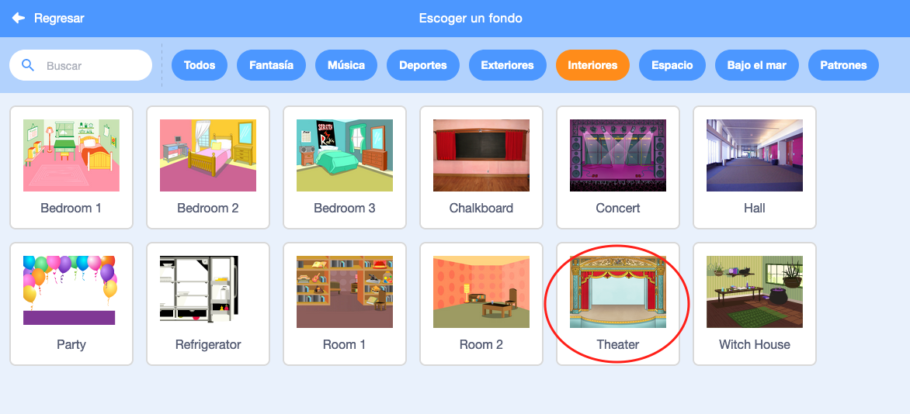

## El Escenario

El **Escenario** es la zona de la derecha, y es donde tu proyecto cobra vida. Piensa en él como la zona de actuación, ¡como si fuera un escenario de verdad!

--- task ---

De momento, el escenario es blanco y ¡se ve bastante aburrido! Añádele un fondo haciendo clic en **Elige un fondo**.

--- /task ---

--- task ---

Haz clic en **Interiores** en la lista de la parte superior. Luego haz clic en el fondo de un teatro.

--- /task ---

--- task ---

Haz clic y arrastra el tambor hasta la parte inferior del escenario.

--- /task ---

--- task ---

Ahora tu escenario debe tener este aspecto:

--- /task ---