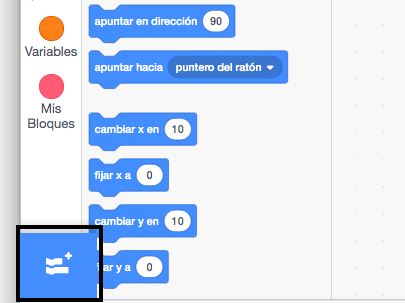
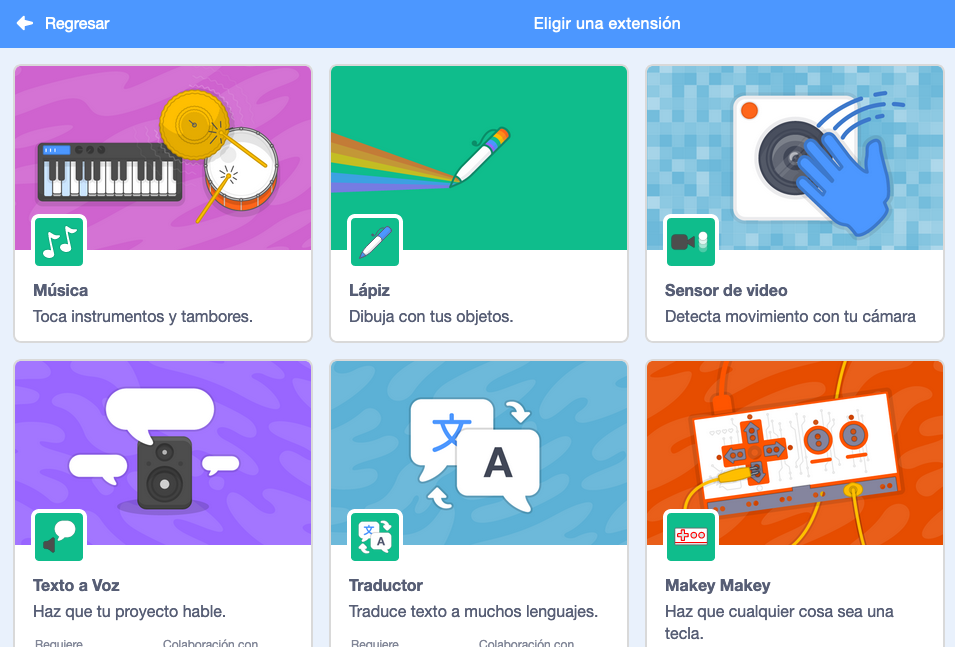

## Haciendo un tambor

Ahora vas a añadir código a tu tambor para que haga un sonido cuando se haga clic sobre él.

Puedes encontrar los bloques de código en la pestaña Código, ¡y todos están codificados por colores!

--- task ---

Primero añade la extensión **Música** para que puedas tocar instrumentos.

Haz clic en el botón **Agregar extensión** en la esquina inferior izquierda.



Haz clic en la extensión **Música** para añadirla.



--- /task ---

--- task ---

Haz clic en el objeto tambor, y luego arrastra estos dos bloques al área de código de la derecha:

```blocks3
al hacer clic en este objeto
tocar tambor (\ (1 \) Caja v) durante (0.25) pulsos
```

--- no-print ---


--- /no-print ---

Asegúrate de que los bloques estén conectados entre sí (como los ladrillos de LEGO).

--- /task ---

--- task ---

¡Haz clic en el tambor para probar tu nuevo instrumento!

--- /task ---