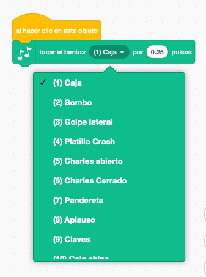
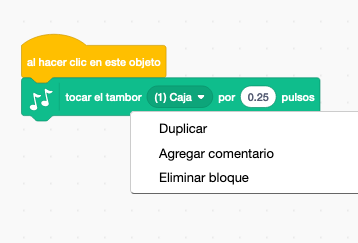

## Desafío: mejora tu tambor

¿Sabes cómo cambiar el sonido del tambor cuando haces clic encima de él?



¿Puedes hacer también que el tambor emita un sonido cuando se presiona la barra espaciadora? Tendrás que utilizar este bloque `evento`{: class = "block3events"}:

```blocks3
al presionar la tecla [espacio v]
```

Puedes copiar tu código existente haciendo clic encima de él con el botón derecho y luego haciendo clic en **Duplicar**.

