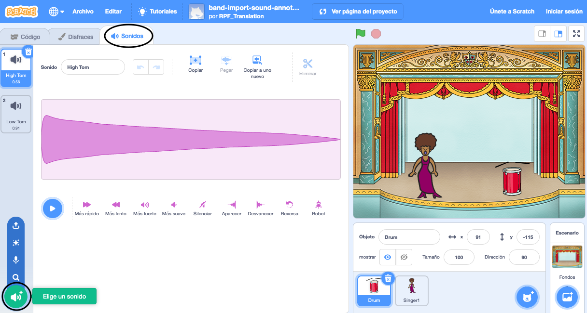
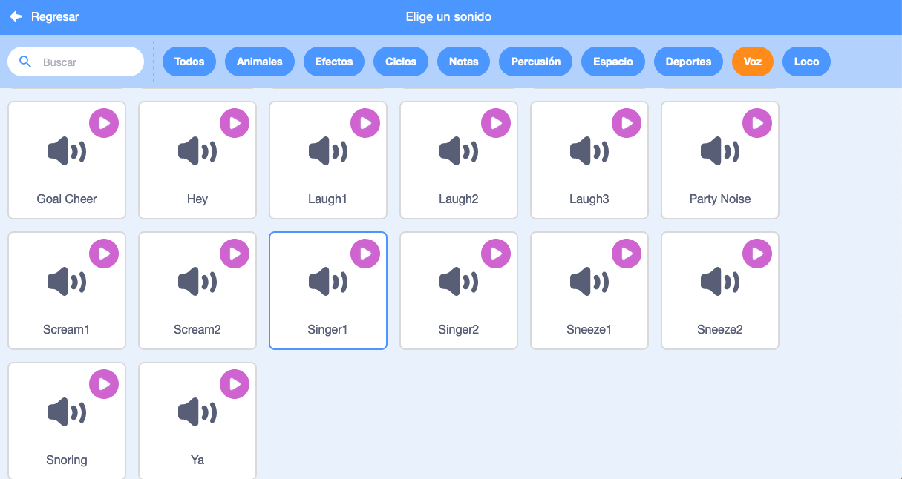

## Haciendo un cantante

Ahora agregarás un cantante a tu banda!

\--- task \---

Añade un objeto de cantante a tu escenario.


[[[generic-scratch3-sprite-from-library]]]

\--- /task \---

\--- task \---

Antes de que puedas hacer cantar a tu cantante, necesitas añadir un sonido a tu objeto. Asegúrate de que has seleccionado a tu cantante, luego haz clic en la pestaña Sonidos, y haz clic en **Choose a sound** Selecciona un sonido de la biblioteca:

 \--- /task \---

\--- task \--- Haga clic en **Voice** Voz en la lista de arriba, y luego elija un sonido para añadir a su sprite.

 \--- /task \---

\--- task \--- Para usar el sonido, agrega los siguientes bloques de código a tu sprite de cantante:

```blocks3
when this sprite clicked
play sound (singer1 v) until done
```

\--- /task \---

\--- task\--- Haz clic en tu cantante en la etapa y ve lo que sucede. ¿canta? \--- /task \---