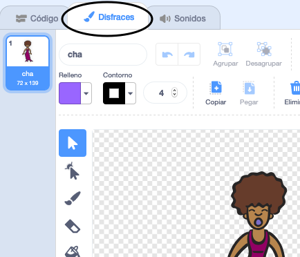
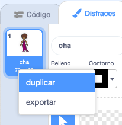
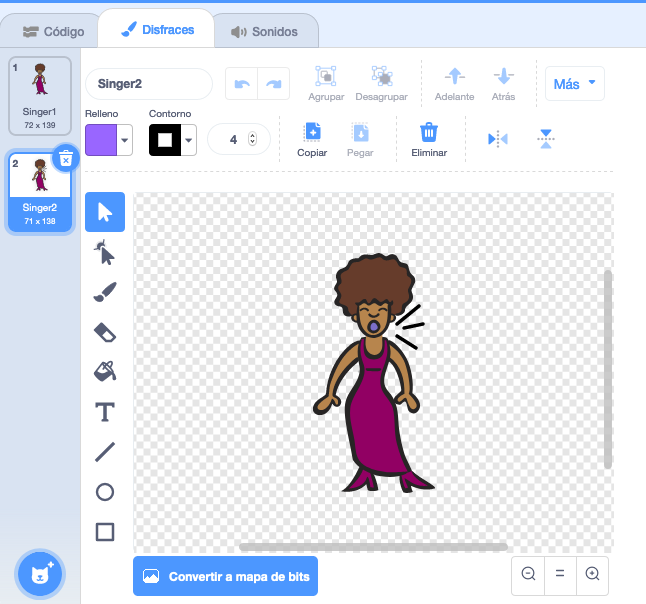
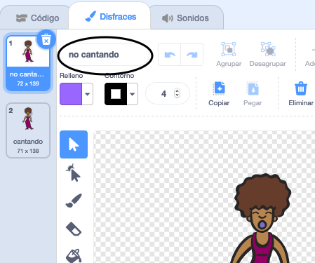

## Disfraces

¡Ahora harás que tu cantante se vea como si estuviera cantando!

--- task ---

Puedes cambiar el aspecto de tu cantante cuando haces clic para que cante, creando un nuevo disfraz. Haz clic en la pestaña Disfraces y verás la imagen de la cantante.



--- /task ---

--- task ---

Haz clic en el botón derecho sobre el disfraz y luego haz clic en **Duplicar** para crear una copia.



--- /task ---

--- task ---

Haz clic en el nuevo disfraz (llamado 'Cantante2'), y luego selecciona la herramienta de Línea y dibuja líneas para que parezca que tu cantante está emitiendo sonidos.



--- /task ---

--- task ---

Los nombres de los disfraces no son muy útiles por el momento. Escribe en los cuadros de texto de los disfraces para cambiar sus nombres a 'no cantando' y 'cantando'.



--- /task ---

--- task ---

Ahora que tienes dos disfraces diferentes para tu cantante, ¡puedes elegir qué disfraz se muestra! Añade estos dos bloques de código a tu objeto cantante:

```blocks3
when this sprite clicked
+switch costume to (cantando v)
play sound (Cantante1 v) until done
+switch costume to (no cantando v)
```

El bloque de código para cambiar el disfraz está en la sección `Apariencia`{:class="block3looks"}.

--- /task ---

--- task ---

Haz clic en tu cantante en el escenario. ¿Parece que está cantando?

--- /task ---

--- task ---

¡Ahora haz que tu tambor parezca que está siendo golpeado!


- Como ayuda puedes utilizar las instrucciones para cambiar el disfraz de tu objeto cantante.

¡No te olvides de comprobar si tu nuevo código funciona!

--- /task ---