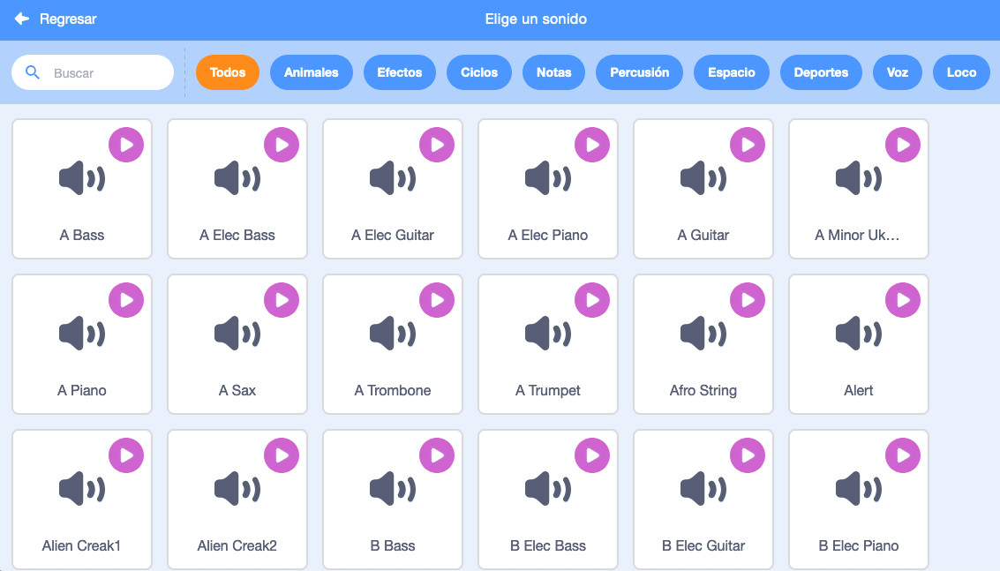
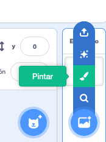
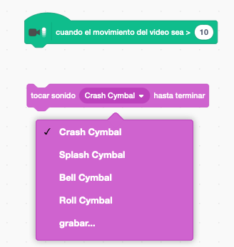

## Challenge: mejora tu banda

¡Usa lo que has aprendido en este proyecto para crear tu propia banda! Puedes crear cualquier instrumento que quieras - para darte algunas ideas, echa un vistazo a los sonidos y instrumentos disponibles.



```blocks3
when this sprite clicked
set instrument to (\(1\) Piano v)
play note (60) for (0.25) beats
```

Sin embargo, sus instrumentos no tienen que ser realistas. Por ejemplo, ¡podrías hacer un piano hecho de magdalenas!


Puedes usar más sprites de la biblioteca, y también puedes pintar tus propios sprites!



## \--- collapse \---

## title: ¿Por qué 'salta' el objeto cuando cambia de disfraz?

Cuando creas tu propio objeto, a lo mejor descubrirás que cuando haces clic encima de él, este 'salta' cuando cambia de disfraz. Esto pasa si los dos disfraces no están centrados en el mismo punto.

Para arreglar esto, asegúrese de que los centros de los trajes de su sprite son los mismos.

\--- /collapse \---

Si tiene un micrófono, puede grabar sus propios sonidos, ¡e incluso puede usar una cámara web para tocar sus instrumentos!

