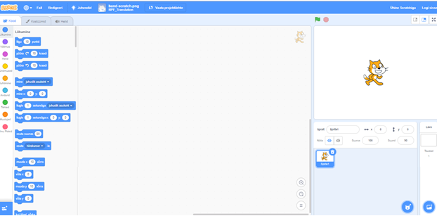
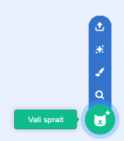
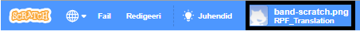

## Spraidid

Enne kodeerimise alustamist pead koodi lisama "asja". Scratchis nimetatakse neid "asju" **spraitideks**.

\--- task \--- Ava uus Scratchi projekt.

**Veebis:**ava uus Scratchi veebiprojekt aadressil [rpf.io/scratch-new](http://rpf.io/scratch-new){:target="_blank"}.

**Offline:** avab võrguühenduseta redaktoris uue projekti.

Kui teil on vaja alla laadida ja paigaldada Scratch offline redaktor, leiate selle aadressilt [rpf.io/scratchoff](http://rpf.io/scratchoff){: target = "_ blank"}.

See näeb välja selline:

 \--- / ülesanne \--- \--- ülesanne \--- Kassitõbi, mida näete, on Scratch maskott. Sa ei vaja seda mängu, nii et vabanege sellest, klõpsates seda hiire parema nupuga ja seejärel klõpsates nupul ****.

 \--- / ülesanne \---

\--- ülesanne \--- Järgmine, klõpsake **Valige sprite raamatust** et avada kõigi Scratch spritide nimekiri.

 \--- / ülesanne \---

\--- ülesanne \--- Kerige alla, kuni näete trumli sprite. Klõpsake trumlil, et see oma projektile lisada.

\--- / ülesanne \---

\--- ülesanne \---

Klõpsake ja lohistage trumli etapi põhjale.

\--- / ülesanne \---

\--- ülesanne - Anna oma programmile nimi, tippides ülaosas olevasse tekstikasti.

Seejärel klõpsake nuppu **Fail**ja seejärel **Salvesta nüüd** projekti salvestamiseks.

Kui te ei ole võrgus või teil pole Scratch-kontot, saate oma projekti koopia salvestada, klõpsates selle asemel nuppu **Salvesta oma arvutisse**.

 \--- / ülesanne \---