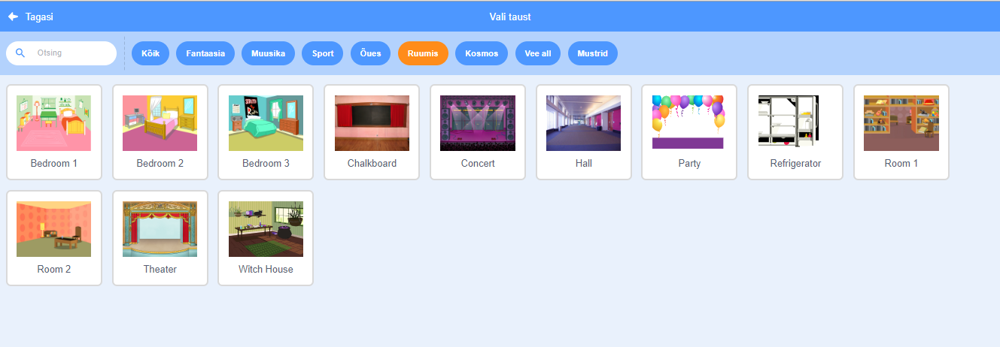

## Lava

**Lava** on ala paremal ja koht, kus su projekt ärkab ellu. Mõtle sellele kui esinemisalale, just nagu päris lava!

\--- task \--- Praegu on lava valge ja tundub üsna igav! Lisa sellele taust, klõpsates nupul **Vali taust**.

 \--- /task \---

\--- task \--- Klõpsa loendi ülaosas oleval **Ruumis**. Seejärel klõpsa teatri taustal.

 \--- /task \---

\--- task \--- Sinu lava peaks nüüd sarnanema sellele:

 \--- /task \---