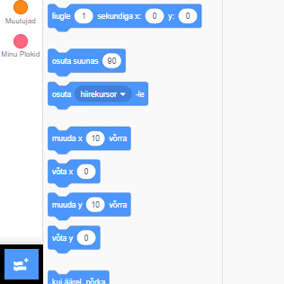
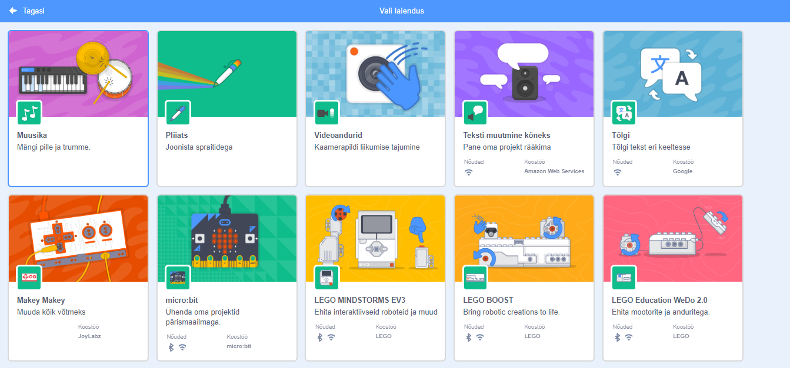
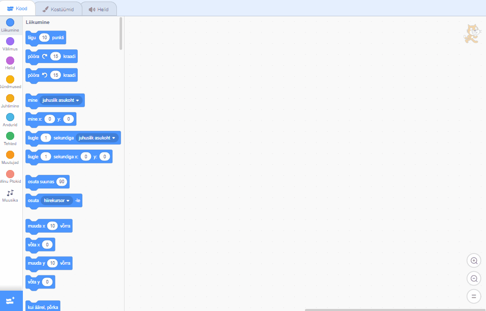

## Trumli tegemine

Nüüd lisate oma trummile koodi, nii et trummel klõpsates annab heli.

Koodiplokid leiate vahekaardil Skriptid ja need on kõik värvikoodid!

\--- ülesanne \---

Esmalt lisage laiendus **Music** et saaksite mängida instrumente.

Klõpsake nupul **Lisa laiendus** vasakus alumises nurgas.



Klõpsake selle laiendamiseks nuppu **Muusika**.



\--- / ülesanne \---

\--- ülesanne \--- Klõpsa trumli sprite ja lohista need kaks plokki paremal asuvasse koodiala:

```blocks3
kui see sprite klõpsas
mängurummi ((1) Snare Drum v) (0,25) löögi jaoks
```

\--- no-print \---



\--- / no-print \---

Make sure that the blocks are connected together (like LEGO bricks).

\--- /task \---

\--- task \--- Click on the drum to try out your new instrument! \--- /task \---