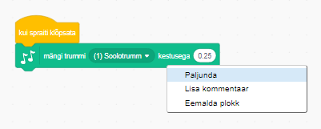

## Väljakutse: oma trummi täiustamine

Kas oskad muuta heli, mida trumm klõpsamisel teeb?


Kas oskad ka trummi häält tegema panna, kui tühikuklahvi vajutada? Pead kasutama seda `sündmuse`{:class="block3events"} plokki:

```blocks3
kui klõpsata klahvi [tühik v]
```

Kui soovid oma olemasolevat koodi kopeerida, siis klõpsa seda hiire parema nupuga ja seejärel klõpsa **paljunda**.

