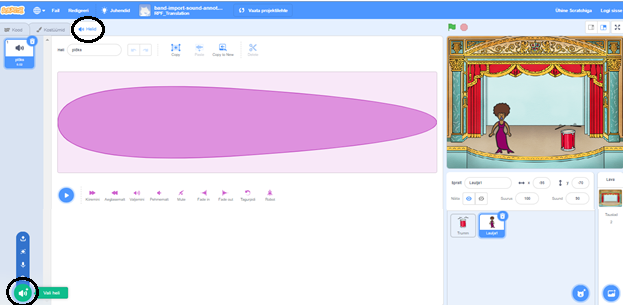
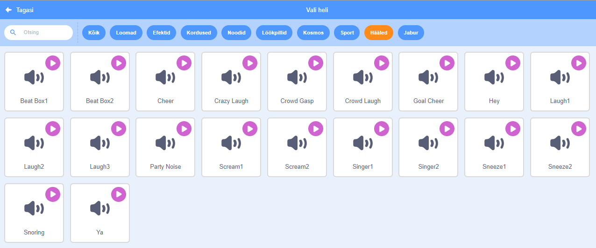

## Laulja tegemine

Nüüd lisad oma bändile laulja!

\--- task \---

Lisa oma Lavale laulja sprait.


[[[generic-scratch3-sprite-from-library]]]

\--- /task \---

\--- task \---

Enne, kui saad oma laulja laulma panna, pead oma laulja spraidile lisama heli. Veendu, et oled valinud oma laulja spraidi, seejärel klõpsa vahekaardil Helid ja siis klõpsa nupul **Vali heli**:



\--- /task \---

\--- task \---

Click on **Voice** in the list at the top, and then choose a sound to add to your sprite.



\--- /task \---

\--- task \---

To use the sound, add the following code blocks to your singer sprite:

```blocks3
kui spraiti klõpsata
mängi heli (laulja1 v) kuni lõpuni
```

\--- /task \---

\--- task \---

Click on your singer on the stage and see what happens. Does she sing?

\--- /task \---