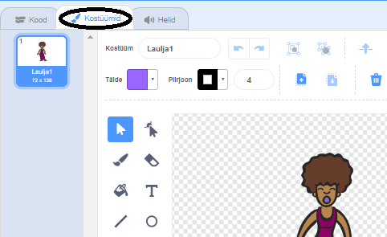
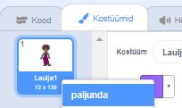
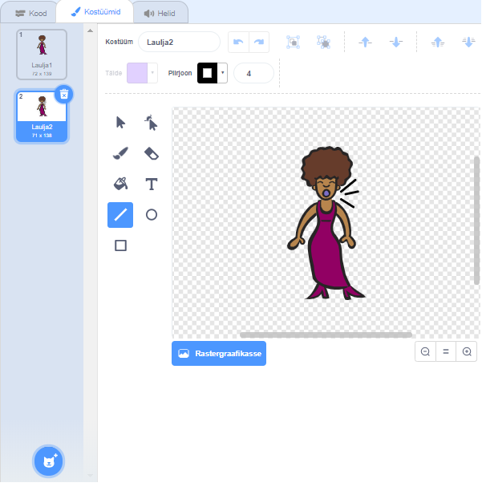
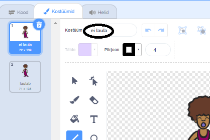

## Kostüümid

Nüüd teete oma laulja välja nagu ta laulab!

\--- ülesanne - Uue kostüümi loomisel saate muuta, kuidas teie laulja sprite välja näeb. Klõpsake vahekaardil Kostüümid ja näete laulja kostüümi.

 \--- / ülesanne \---

\--- ülesanne \--- Paremklõpsake kostüümil ja seejärel klõpsake selle koopia loomiseks **eksemplari**.

 \--- / ülesanne \---

\--- ülesanne \--- Klõpsa uuele kostüümile (nn „Singer2”), seejärel valige liinitööriist ja joonistage jooned, nii et tundub, et teie laulja teeb heli.

 \--- / ülesanne \---

\--- ülesanne \--- Kostüümide nimed ei ole hetkel väga kasulikud. Sisestage kostüümide tekstikastidesse, et muuta nende nimed "mitte laulmiseks" ja "laulmiseks".

 \--- / ülesanne \---

\--- ülesanne \--- Nüüd, kui sul on oma lauljale kaks erinevat kostüümi, saate valida, millist kostüümi kuvatakse! Lisage need kaks koodiplokki oma laulja sprite:

```blocks3
kui see sprite klõpsas
+ lüliti kostüümi (laulmine v)
esitusheli (laulja1 v) kuni tehtud
+ lülita kostüüm (mitte laulu v)
```

Kostüümi muutmiseks kasutatav koodiplokk on jaotises `Looks`{: class = "block3looks}. \--- / ülesanne \---

\--- ülesanne \--- Klõpsake oma lauljal laval. Kas ta näeb välja nagu ta laulab? \--- / ülesanne \---

\--- ülesanne \--- Tee nüüd oma trummid välja nagu see on!


- Kasutage juhiseid laulja sprite kostüümi muutmiseks, et teid aidata.

Ärge unustage testida, kas teie uus kood töötab! \--- / ülesanne \---