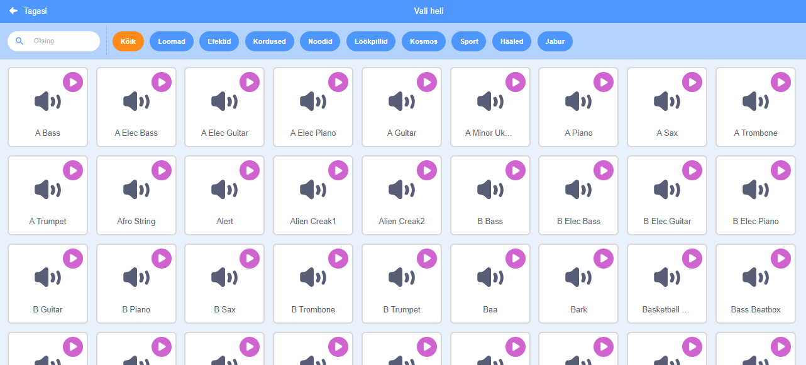
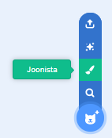
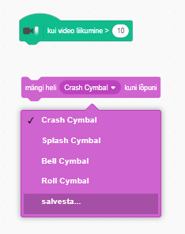

## Väljakutse: parandage oma bändi

Kasutage seda, mida olete selles projektis õppinud, et luua oma bänd! Teil on võimalik luua mistahes meeldivaid vahendeid - vaadata ideid saadaolevatest instrumentidest ja helidest.



```blocks3
kui see sprite klõpsas
seadet (1) Piano v)
mängimärk (60) (0,25) võidab
```

Teie vahendid ei pea olema realistlikud. Näiteks võid teha klaverit, mis on valmistatud muffinitest!


Raamatukogust saab kasutada rohkem spriteid ja te saate ka ise oma spriide värvida!



## \--- kollaps \---

## pealkiri: Miks on minu sprite hüpped, kui see kostüümi muudab?

Oma sprite loomisel võib juhtuda, et sprite klõpsamisel hüppab see kostüümi muutmisel. Seda seetõttu, et kaks kostüümi ei ole samas kohas.

Selle parandamiseks veenduge, et teie sprite kostüümide keskused on samad.

\--- / kollaps \---

Kui teil on mikrofon, saate salvestada oma helisid ja kasutada isegi oma veebikaamerat oma instrumentide tabamiseks!

