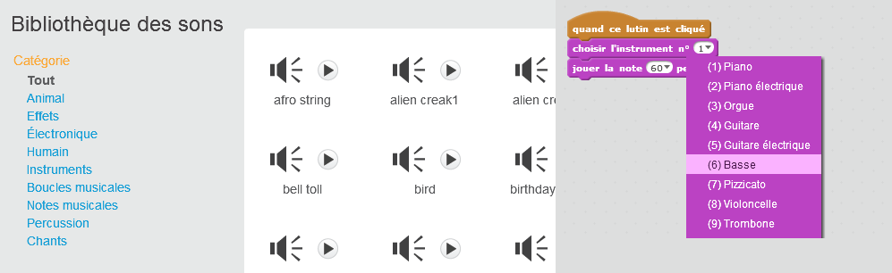
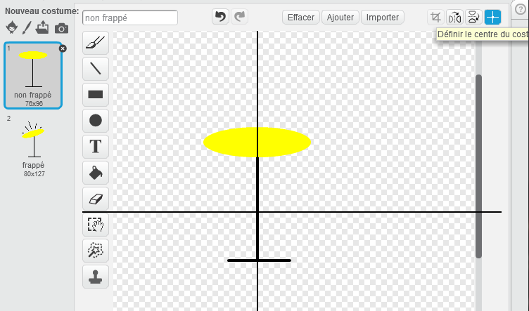

--- challenge ---

## Défi: faites votre propre groupe

Utilise ce que tu as appris dans ce projet pour créer ton propre groupe! Tu peux créer tous les instruments que tu aimes - regardes les sons et les instruments disponibles pour te donner des idées.

Tes instruments ne doivent pas forcément être réalistes cependant. Par exemple, Tu pourrais créer un piano fait de muffins!

En plus d'utiliser des lutins existants, tu peux également dessiner les tiens.

--- collapse ---
---
title: Pourquoi mon lutin «saute» quand il change de costume?
---

+ Lorsque tu crées ton propre lutin, tu peux constater que lorsque tu cliques dessus, celui-ci «saute» lorsqu'il change de costume. C'est parce que les deux costumes ne sont pas centrés au même endroit.

Pour résoudre ce problème, clique sur ** Définir le centre de costume ** sur les deux costumes, et assure-toi que le centre est au même point dans les deux costumes.

--- /collapse ---

Si tu as un microphone, tu peut enregistrer vos propres sons, ou même utiliser une webcam pour frapper tes instruments!

--- /challenge ---