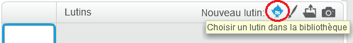
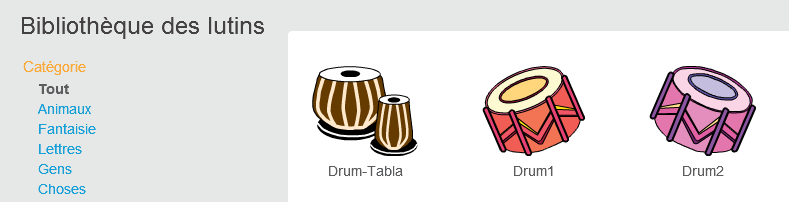

## Sprites

Avant de commencer à coder, vous devez ajouter une «chose» au code. Dans Scratch, ces 'choses' sont appelées **sprites** .

\--- task \---

Ouvre un nouveau projet Scratch.

**En ligne:** ouvre un nouveau projet Scratch en ligne sur [rpf.io/scratch-new](http://rpf.io/scratch-new) {:target="_blank"}.

**Hors ligne:** ouvre un nouveau projet dans l'éditeur hors ligne.

Si tu dois télécharger et installer l'éditeur hors ligne Scratch, tu peux le trouver à [rpf.io/scratchoff](http://rpf.io/scratchoff){:target="_blank"}.

Ça ressemble ça :

\--- /task \---

\--- task \---

Le sprite de chat que tu peux voir est la mascotte de Scratch. Tu n'en as pas besoin pour ce jeu, alors débarrasse-toi de cela en cliquant sur le X dans le coin.

\--- /task \---

\--- task \---

Ensuite, clique sur **Choisir un sprite à partir de la bibliothèque** pour ouvrir une liste de tous les sprite Scratch.

\--- /task \---

\--- task \---

Fais défiler jusqu'à ce que tu trouves un sprite de tambour. Clique sur un tambour pour l'ajouter à ton projet.

\--- /task \---

\--- task \---

Si tu es connecté à ton compte Scratch, saisis le titre de ton projet dans la zone de titre du projet en haut de l'écran :

**Astuce :** Donne à tes projets des noms utiles afin de pouvoir les retrouver facilement lorsque tu auras de nombreux projets.

Puis, tu peux cliquer sur Fichier, et sur Sauvegarder maintenant pour enregistrer ton projet.

Si tu n’es pas en ligne, tu peux enregistrer une copie de ton projet en cliquant sur **Sauvegarder sur votre ordinateur**.

\--- /task \---