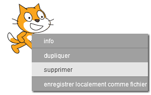
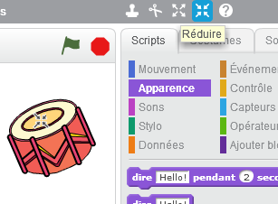

## Lutins

Avant de commencer à coder, vous devez ajouter une «chose» au code. Dans Scratch, ces 'choses' sont appelées ** lutins ** .

+ D'abord, ouvrez l'éditeur Scratch. Vous pouvez trouver l'éditeur en ligne de Scratch à <a href="http://jumpto.cc/scratch-new" target="_blank"> jumpto.cc/scratch-new </a> . Ceci ressemble a ça :
    
    

+ Le lutin de chat que vous pouvez voir est la mascotte Scratch. Débarrassons nous en en cliquant dessus avec le bouton droit puis ** supprimer ** .
    
    

+ Next, click **Choose sprite from library** to open up a list of all the Scratch sprites.
    
    

+ Scroll down until you see a drum sprite. Click on a drum, and click **OK** to add it to your project.
    
    

+ Click the **shrink** icon, and then click on the drum a few times to make it smaller.
    
    

Give your program a name by typing one into the text box in the top left-hand corner.

You can then click **File** and then **Save now** to save your project. If you don't have a Scratch account, you can save a copy of your project by clicking **Download to your computer** instead.

