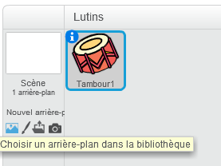
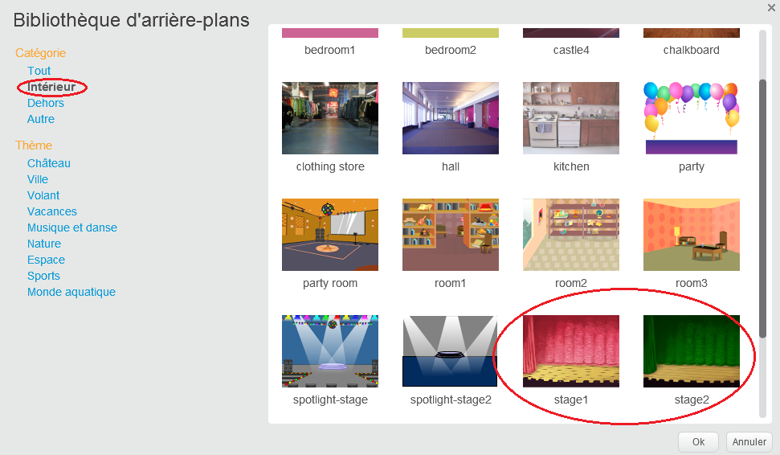

## La scène

La **scène** est la zone sur la droite et c'est où ton projet prend vie. Considère-le comme une zone de performance, tout comme une scène réelle !

\--- task \---

Pour le moment, la scène est blanche et semble plutôt ennuyeuse ! Ajoute un arrière-plan en cliquant sur **Choisir un arrière-plan**.

\--- /task \---

\--- task \---

Clique sur **Intérieur** dans la liste en haut. Puis clique sur un décor de théâtre.

\--- /task \---

\--- task \---

Clique et fais glisser le tambour en bas de la scène.

\--- /task \---

\--- task \---

Ta scène devrait maintenant ressembler à ceci :

\--- /task \---