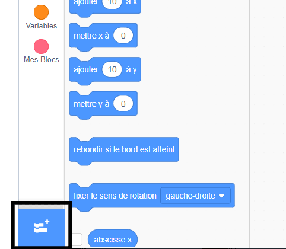
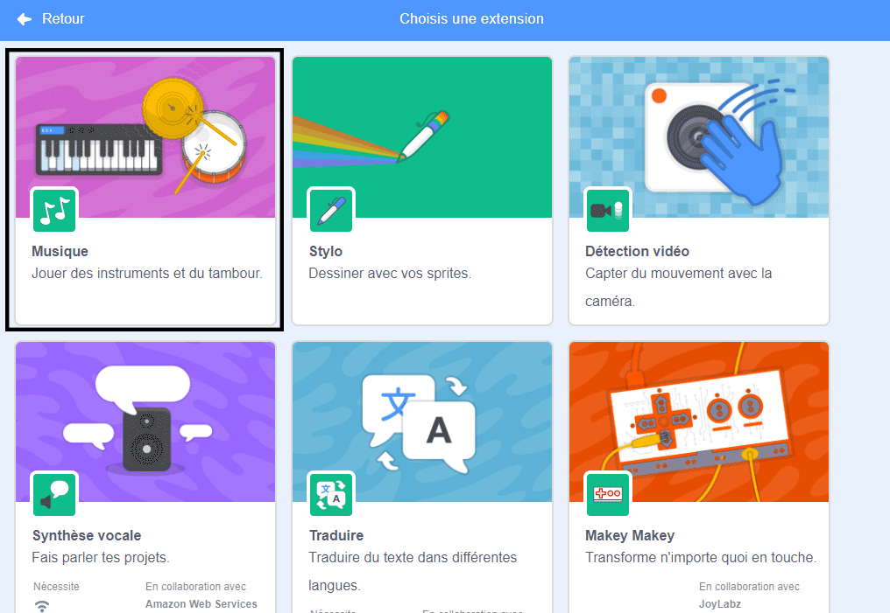
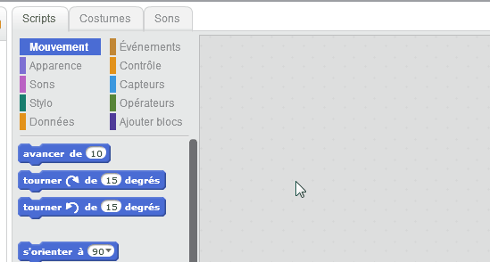

## Créer un tambour

Maintenant, tu vas ajouter du code à ta batterie afin que le tambour fasse un son quand il est cliqué.

Tu peux trouver les blocs de code dans l'onglet Scripts, et ils ont tous un code couleur!

--- task ---

Ajoute d'abord l'extension **Musique** pour pouvoir jouer des instruments.

Clique sur le bouton **Ajouter une extension** dans le coin en bas, à gauche.



Clique sur l'extension **Musique** pour l'ajouter.



--- /task ---

--- task --- Clique sur le sprite de batterie, puis fait glisser ces deux blocs dans la zone de code à droite :

```blocks3
when this sprite clicked
play drum ((1) Caisse claire v) for (0.25) beats
```

--- no-print ---



--- /no-print ---

Assure-toi que les blocs sont connectés ensemble (comme les briques LEGO).

--- /task ---

--- task --- Clique sur le tambour pour essayer ton nouvel instrument! --- /task ---