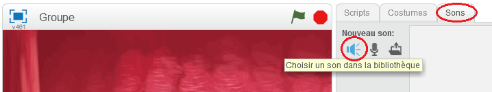

## Création d'un Chanteur

Ajoutons un chanteur à votre orchestre!

+ Ajoutez 2 autres lutins, un chanteur et un micro à votre étape.

	

+ Avant que vous ne puissiez faire chanter votre chanteur, vous devez ajouter un son à votre lutin. Assurez-vous que vous avez bien selectionné votre chanteur, cliquez sur l'onglet 'Sons' et cliquez sur ' Choisir un son dans la bibliothèque ' :

	

+ Si vous cliquez sur 'chants' du côté gauche, vous pourrez alors choisir un son approprié pour votre lutin.

	

+ Maintenant que le son a bien été installé, vous pouvez ajouter ce code à votre chanteur :

	```blocks
		quand ce lutin est cliqué
		jouer le son [singer 1 v] jusqu'au bout
	```

+ Cliquez sur votre chanteur pour vous assurer qu'il chante.
